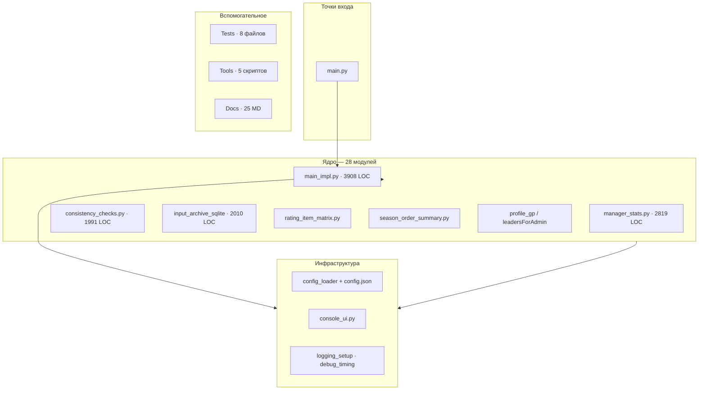
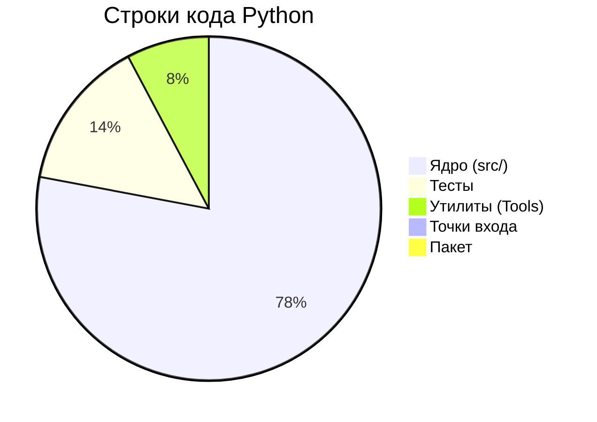
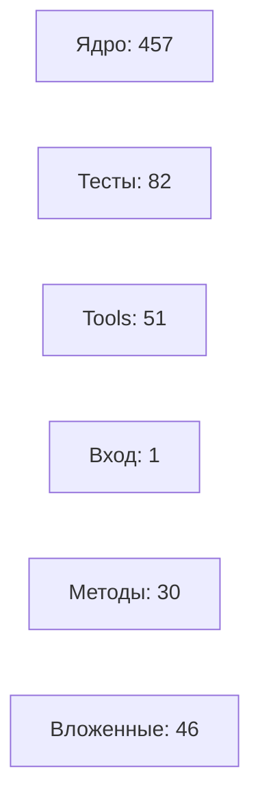
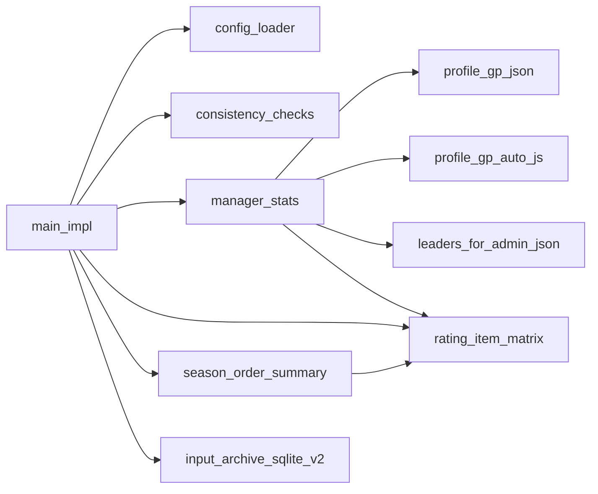
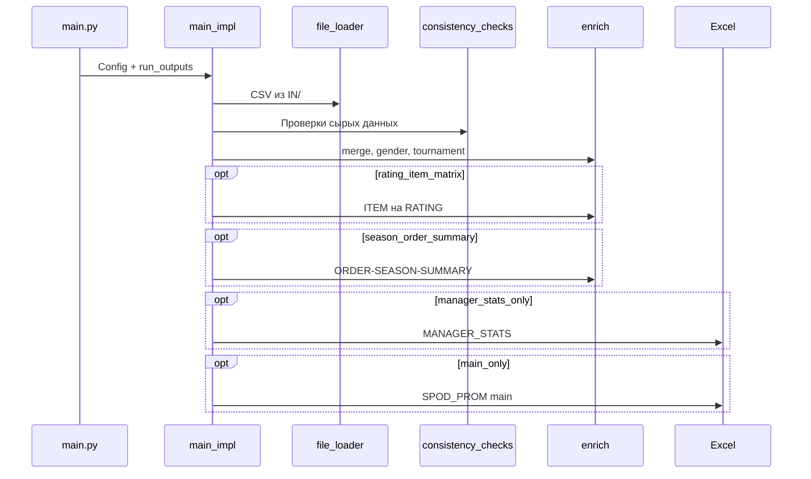

# Аналитика кодовой базы SPOD_PROM

> **Дата снимка:** 2026-06-14 23:10  
> **Метод:** статический разбор AST + подсчёт строк (Python 3, без `IN/`, `OUT/`, `LOGS/`)  
> **Пересборка:** `python src/Tools/build_codebase_analytics.py`

---

## 1. Масштаб проекта — краткая сводка

Пайплайн обработки CSV/JSON выгрузок PROM → Excel: проверки консистентности, merge, enrich, режимы `run_outputs`.

| Показатель | Значение |
|------------|----------|
| Python-файлов | **45** |
| Модулей ядра `src/` (без Tests/Tools) | **28** |
| Всего строк (физических) | **25 257** |
| **Строк кода** (без пустых и `#`) | **21 948** |
| Пустых строк | 2 693 |
| Строк комментариев `#` | 616 |
| Классов (определений / уникальных имён) | **14** / 11 |
| Функций верхнего уровня | **591** |
| Методов классов | 30 |
| Вложенных функций | 46 |
| **Всего callable** (fn+method+nested) | **667** |
| Модульных переменных | 126 |
| Декораторов | 29 |
| Функций с type hints | 628 |
| Блоков `try/except` | 110 |
| Импортов `import` / `from` | 149 / 199 |
| `config.json` | **5 993** строк |
| Документация MD | **26** файлов  **9 206** строк |
| `README.md` | 1 740 строк |
### Визуальный масштаб

```
Python LOC     [████████████████████████████████░░░░] 21 948
config.json    [█████████░░░░░░░░░░░░░░░░░░░░░░░░░░░] 5 993
Документация   [█████████████░░░░░░░░░░░░░░░░░░░░░░░] 9 206
ВСЕГО текста   [████████████████████████████████████] ~40 456
```
---

## 2. Структура проекта


---

## 3. Разбивка по категориям


| Категория | Файлов | LOC | Доля | Классов | Функций |
|-----------|--------|-----|------|---------|---------|
| Ядро (src/) | 28 | 17 078 | 77.8% | 10 | 457 |
| Тесты | 8 | 3 128 | 14.3% | 2 | 82 |
| Утилиты (Tools) | 6 | 1 700 | 7.7% | 2 | 51 |
| Точки входа | 2 | 40 | 0.2% | 0 | 1 |
| Пакет | 1 | 2 | 0.0% | 0 | 0 |
---

## 4. Топ-15 файлов по объёму кода

| # | Файл | Категория | Всего | LOC | Классы | Fn |
|---|------|-----------|-------|-----|--------|-----|
| 1 | `src/main_impl.py` | Ядро (src/) | 5004 | 3908 | 1 | 67 |
| 2 | `src/manager_stats.py` | Ядро (src/) | 3133 | 2819 | 3 | 88 |
| 3 | `src/Tests/test_manager_stats.py` | Тесты | 2270 | 2165 | 0 | 40 |
| 4 | `src/consistency_checks.py` | Ядро (src/) | 2200 | 1991 | 0 | 47 |
| 5 | `src/input_archive_sqlite.py` | Ядро (src/) | 1356 | 1232 | 0 | 27 |
| 6 | `src/input_archive_sqlite_v2.py` | Ядро (src/) | 849 | 778 | 0 | 13 |
| 7 | `src/Tools/build_spod_input_catalog.py` | Утилиты (Tools) | 819 | 737 | 1 | 19 |
| 8 | `src/json_spod_format_check.py` | Ядро (src/) | 808 | 710 | 1 | 31 |
| 9 | `src/rating_item_matrix.py` | Ядро (src/) | 803 | 701 | 0 | 23 |
| 10 | `src/leaders_for_admin_auto_js.py` | Ядро (src/) | 739 | 678 | 0 | 7 |
| 11 | `src/console_ui.py` | Ядро (src/) | 627 | 548 | 0 | 27 |
| 12 | `src/Tools/build_codebase_analytics.py` | Утилиты (Tools) | 497 | 441 | 1 | 7 |
| 13 | `src/season_order_summary.py` | Ядро (src/) | 486 | 424 | 0 | 14 |
| 14 | `src/debug_timing.py` | Ядро (src/) | 464 | 398 | 0 | 16 |
| 15 | `src/profile_gp_auto_js.py` | Ядро (src/) | 441 | 385 | 0 | 12 |
```
main_impl.py                             ████████████████████████████ 3 908
manager_stats.py                         ████████████████████░░░░░░░░ 2 819
Tests/test_manager_stats.py              ████████████████░░░░░░░░░░░░ 2 165
consistency_checks.py                    ██████████████░░░░░░░░░░░░░░ 1 991
input_archive_sqlite.py                  █████████░░░░░░░░░░░░░░░░░░░ 1 232
input_archive_sqlite_v2.py               ██████░░░░░░░░░░░░░░░░░░░░░░ 778
Tools/build_spod_input_catalog.py        █████░░░░░░░░░░░░░░░░░░░░░░░ 737
json_spod_format_check.py                █████░░░░░░░░░░░░░░░░░░░░░░░ 710
rating_item_matrix.py                    █████░░░░░░░░░░░░░░░░░░░░░░░ 701
leaders_for_admin_auto_js.py             █████░░░░░░░░░░░░░░░░░░░░░░░ 678
console_ui.py                            ████░░░░░░░░░░░░░░░░░░░░░░░░ 548
Tools/build_codebase_analytics.py        ███░░░░░░░░░░░░░░░░░░░░░░░░░ 441
season_order_summary.py                  ███░░░░░░░░░░░░░░░░░░░░░░░░░ 424
debug_timing.py                          ███░░░░░░░░░░░░░░░░░░░░░░░░░ 398
profile_gp_auto_js.py                    ███░░░░░░░░░░░░░░░░░░░░░░░░░ 385
```
---

## 5. Классы

**14** определений в **11** файлах.

| Класс | Файл |
|-------|------|
| `PathStats` | `src/Tests/analyze_contest_feature.py` |
| `PathStats` | `src/Tests/analyze_reward_add_data.py` |
| `_Metrics` | `src/Tools/build_codebase_analytics.py` |
| `PathStats` | `src/Tools/build_spod_input_catalog.py` |
| `Config` | `src/config_loader.py` |
| `FileLoader` | `src/file_loader.py` |
| `RowHashRecord` | `src/input_archive_row_parallel.py` |
| `ClassifiedRow` | `src/input_archive_row_parallel.py` |
| `SpodParseError` | `src/json_spod_format_check.py` |
| `CallerFormatter` | `src/logging_setup.py` |
| `CallerFormatter` | `src/main_impl.py` |
| `_SourceIndexEntry` | `src/manager_stats.py` |
| `_EnrichFieldContext` | `src/manager_stats.py` |
| `_PromTabColumnSpec` | `src/manager_stats.py` |
---

## 6. Функции


| Тип | Количество |
|-----|------------|
| Верхний уровень | 591 |
| Методы | 30 |
| Вложенные | 46 |
| **Итого** | **667** |
---

## 7. Модули и зависимости

### Наиболее импортируемые модули `src.*`

| Модуль | Файлов-импортёров |
|--------|-------------------|
| `src.config_loader` | 11 |
| `src.profile_gp_auto_js` | 9 |
| `src.manager_stats` | 8 |
| `src.json_utils` | 6 |
| `src.src` | 5 |
| `src.csv_headers` | 4 |
| `src.rating_item_matrix` | 4 |
| `src.leaders_for_admin_auto_js` | 4 |
| `src.debug_timing` | 4 |
| `src.input_archive_row_hash` | 3 |
| `src.input_archive_row_parallel` | 3 |
| `src.profile_gp_json` | 3 |
| `src.input_archive_sqlite_v2` | 3 |
| `src.consistency_checks` | 3 |
| `src.config_holder` | 2 |
| `src.main_impl` | 2 |
| `src.leaders_for_admin_json` | 2 |
| `src.season_order_summary` | 2 |
| `src.input_archive_sqlite` | 2 |
| `src.reward_item_catalog` | 2 |

### Внешние библиотеки

| Пакет | Упоминаний |
|-------|------------|
| **pandas** | 29 |
| **openpyxl** | 5 |
| **numpy** | 3 |

### Стандартная библиотека (топ-10)

| Модуль | Упоминаний |
|--------|------------|
| `typing` | 34 |
| `__future__` | 29 |
| `json` | 21 |
| `logging` | 20 |
| `pathlib` | 13 |
| `datetime` | 13 |
| `os` | 12 |
| `collections` | 11 |
| `time` | 11 |
| `re` | 10 |

### Граф связей ядра


---

## 8. Пайплайн выполнения


---

## 9. Полный реестр Python-файлов

| Файл | Кат. | Всего | LOC | Пуст. | `#` | Cls | Fn | Imp |
|------|------|-------|-----|-------|-----|-----|----|----|
| `main.py` | entr | 22 | 15 | 6 | 1 | 0 | 1 | 4 |
| `run_main.py` ⚠️ | entr | 39 | 25 | 7 | 7 | 0 | 0 | 0 |
| `src/Tests/analyze_contest_feature.py` | test | 341 | 294 | 45 | 2 | 1 | 8 | 7 |
| `src/Tests/analyze_reward_add_data.py` | test | 384 | 325 | 49 | 10 | 1 | 9 | 7 |
| `src/Tests/test_csv_headers.py` | test | 17 | 10 | 6 | 1 | 0 | 2 | 2 |
| `src/Tests/test_input_archive_row_hash.py` | test | 44 | 32 | 11 | 1 | 0 | 4 | 5 |
| `src/Tests/test_manager_stats.py` | test | 2270 | 2165 | 104 | 1 | 0 | 40 | 16 |
| `src/Tests/test_rating_item_matrix.py` | test | 115 | 93 | 21 | 1 | 0 | 9 | 3 |
| `src/Tests/test_run_outputs.py` | test | 79 | 66 | 12 | 1 | 0 | 5 | 2 |
| `src/Tests/test_season_order_summary.py` | test | 156 | 143 | 12 | 1 | 0 | 5 | 2 |
| `src/Tools/build_codebase_analytics.py` | tool | 497 | 441 | 55 | 1 | 1 | 7 | 7 |
| `src/Tools/build_profile_gp_auto_js.py` | tool | 104 | 81 | 22 | 1 | 0 | 3 | 9 |
| `src/Tools/build_spod_input_catalog.py` | tool | 819 | 737 | 78 | 4 | 1 | 19 | 8 |
| `src/Tools/build_tournament_leaders_auto_js.py` | tool | 45 | 35 | 9 | 1 | 0 | 1 | 5 |
| `src/Tools/export_spod_json_examples.py` | tool | 118 | 95 | 20 | 3 | 0 | 5 | 5 |
| `src/Tools/sync_post_txt.py` | tool | 368 | 311 | 56 | 1 | 0 | 16 | 9 |
| `src/__init__.py` | pack | 6 | 2 | 2 | 2 | 0 | 0 | 1 |
| `src/archive_json_columns.py` | core | 236 | 196 | 36 | 4 | 0 | 10 | 6 |
| `src/config_holder.py` | core | 20 | 12 | 7 | 1 | 0 | 2 | 2 |
| `src/config_loader.py` | core | 257 | 201 | 29 | 27 | 1 | 1 | 5 |
| `src/consistency_checks.py` | core | 2200 | 1991 | 190 | 19 | 0 | 47 | 12 |
| `src/console_ui.py` | core | 627 | 548 | 73 | 6 | 0 | 27 | 7 |
| `src/csv_headers.py` | core | 56 | 46 | 9 | 1 | 0 | 3 | 4 |
| `src/debug_timing.py` | core | 464 | 398 | 54 | 12 | 0 | 16 | 11 |
| `src/file_loader.py` | core | 180 | 164 | 14 | 2 | 1 | 0 | 10 |
| `src/gender.py` | core | 204 | 183 | 20 | 1 | 0 | 5 | 5 |
| `src/input_archive_row_hash.py` | core | 93 | 72 | 20 | 1 | 0 | 8 | 5 |
| `src/input_archive_row_parallel.py` | core | 265 | 231 | 32 | 2 | 2 | 10 | 6 |
| `src/input_archive_sqlite.py` | core | 1356 | 1232 | 103 | 21 | 0 | 27 | 12 |
| `src/input_archive_sqlite_v2.py` | core | 849 | 778 | 69 | 2 | 0 | 13 | 16 |
| `src/json_spod_format_check.py` | core | 808 | 710 | 90 | 8 | 1 | 31 | 6 |
| `src/json_utils.py` | core | 243 | 222 | 20 | 1 | 0 | 4 | 8 |
| `src/leaders_for_admin_auto_js.py` | core | 739 | 678 | 60 | 1 | 0 | 7 | 10 |
| `src/leaders_for_admin_json.py` | core | 164 | 139 | 24 | 1 | 0 | 8 | 7 |
| `src/logging_setup.py` | core | 107 | 89 | 17 | 1 | 1 | 3 | 7 |
| `src/main_impl.py` | core | 5004 | 3908 | 650 | 446 | 1 | 67 | 41 |
| `src/manager_stats.py` | core | 3133 | 2819 | 312 | 2 | 3 | 88 | 17 |
| `src/profile_gp_auto_js.py` | core | 441 | 385 | 55 | 1 | 0 | 12 | 12 |
| `src/profile_gp_json.py` | core | 214 | 184 | 29 | 1 | 0 | 7 | 7 |
| `src/rating_item_matrix.py` | core | 803 | 701 | 95 | 7 | 0 | 23 | 10 |
| `src/reward_getcondition_summary.py` | core | 160 | 138 | 19 | 3 | 0 | 4 | 6 |
| `src/reward_item_catalog.py` | core | 311 | 261 | 48 | 2 | 0 | 13 | 5 |
| `src/season_order_summary.py` | core | 486 | 424 | 60 | 2 | 0 | 14 | 6 |
| `src/tournament.py` | core | 103 | 87 | 15 | 1 | 0 | 1 | 6 |
| `src/validation.py` | core | 310 | 281 | 28 | 1 | 0 | 6 | 7 |
---

## 10. Документация

**26** файлов  **9 206** строк.

| Файл | Строк |
|------|-------|
| `README.md` | 1 740 |
| `Docs/JSON/SPOD_INPUT_DATA_CATALOG.md` | 1 697 |
| `Docs/MANAGER_STATS.md` | 657 |
| `Docs/CONSISTENCY_CHECKS_FORMAT.md` | 604 |
| `Docs/CODEBASE_ANALYTICS.md` | 520 |
| `src/Tools/catalog_glossary/REWARD_ADD_DATA_glossary.md` | 375 |
| `Docs/АНАЛИЗ_ПРОВЕРОК_КОНСИСТЕНТНОСТИ.md` | 337 |
| `Docs/SPOD_CONSISTENCY_CHECKS_SQL_MIRROR.md` | 328 |
| `Docs/PERFORMANCE_OPTIMIZATION_PROPOSALS.md` | 321 |
| `Docs/INPUT_ARCHIVE_ROW_LEVEL.md` | 319 |
| `Docs/RATING_MATRIX_COLORS_AND_LOGIC.md` | 307 |
| `Docs/EXCEL_FEATURES_EXAMPLES.md` | 305 |
| … ещё 14 | |
---

## 11. Выводы

1. **Три файла — ~40% кода:** `main_impl.py`  `manager_stats.py`  `consistency_checks.py` (8 718 LOC из 21 948).
2. **config.json** (5 993 строк) по объёму сопоставим с крупнейшим модулем.
3. **Тесты:** 8 файлов  3 128 LOC; лидер — `test_manager_stats.py`.
4. **Зависимости:** `pandas` — основная внешняя; Excel — `openpyxl`; type hints в 628 функциях.
5. **Хабы:** `config_loader`, `profile_gp_auto_js`, `manager_stats` — наиболее связанные модули.
6. **main_impl.py** — монолитный orchestrator (~18% LOC); кандидат на декомпозицию.

---

*Автоматический отчёт. Обновление: `python src/Tools/build_codebase_analytics.py`*