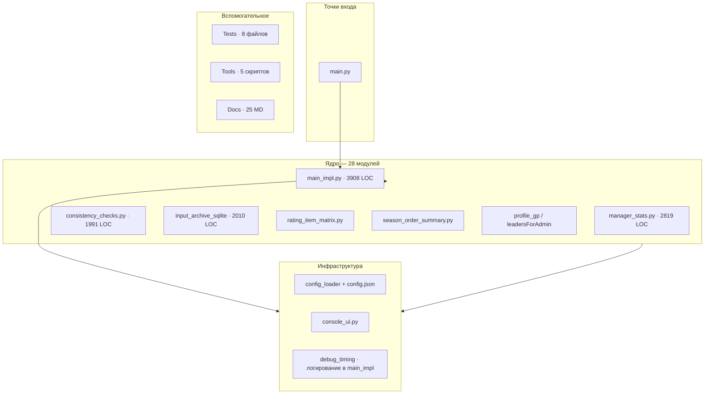
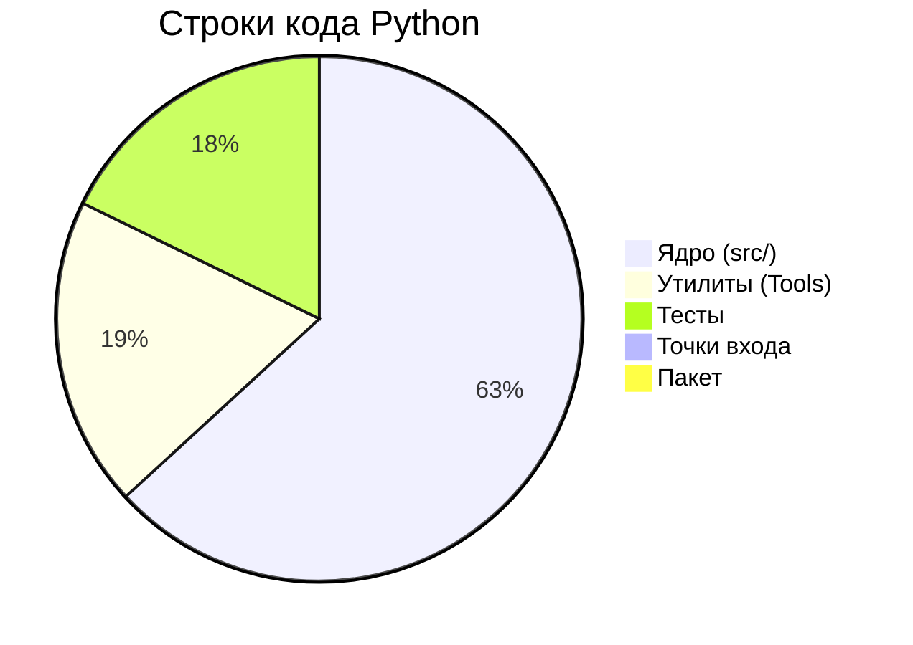
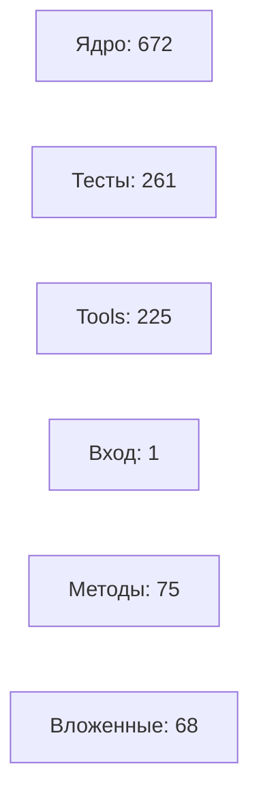
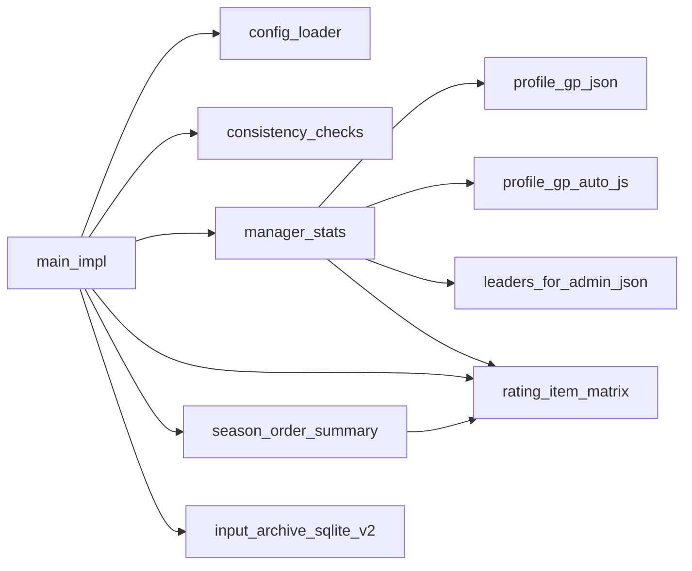
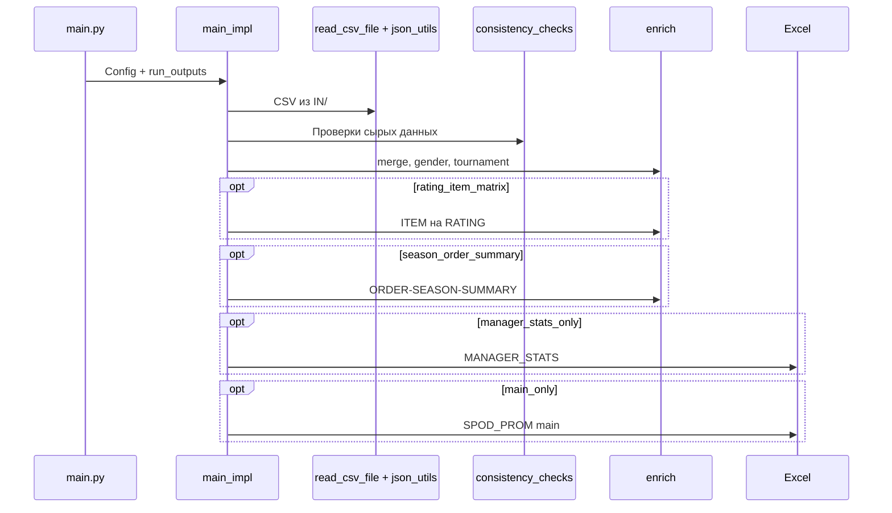

# Аналитика кодовой базы SPOD_PROM

> **Дата снимка:** 2026-09-26 18:17  
> **Метод:** статический разбор AST + подсчёт строк (Python 3, без `IN/`, `OUT/`, `LOGS/`)  
> **Пересборка:** `python src/Tools/build_codebase_analytics.py`

---

## 1. Масштаб проекта — краткая сводка

Пайплайн обработки CSV/JSON выгрузок PROM → Excel: проверки консистентности, merge, enrich, режимы `run_outputs`.

| Показатель | Значение |
|------------|----------|
| Python-файлов | **109** |
| Модулей ядра `src/` (без Tests/Tools) | **43** |
| Всего строк (физических) | **42 260** |
| **Строк кода** (без пустых и `#`) | **36 790** |
| Пустых строк | 4 674 |
| Строк комментариев `#` | 796 |
| Классов (определений / уникальных имён) | **36** / 34 |
| Функций верхнего уровня | **1159** |
| Методов классов | 75 |
| Вложенных функций | 68 |
| **Всего callable** (fn+method+nested) | **1302** |
| Модульных переменных | 397 |
| Декораторов | 48 |
| Функций с type hints | 1274 |
| Блоков `try/except` | 172 |
| Импортов `import` / `from` | 329 / 499 |
| `config.json` | **0** строк |
| Документация MD | **46** файлов  **15 411** строк |
| `README.md` | 2 453 строк |
### Визуальный масштаб

```
Python LOC     [█████████████████████████████████████████████████████] 36 790
config.json    [░░░░░░░░░░░░░░░░░░░░░░░░░░░░░░░░░░░░] 0
Документация   [██████████████████████░░░░░░░░░░░░░░] 15 411
ВСЕГО текста   [████████████████████████████████████████████████████] ~57 671
```
---

## 2. Структура проекта


```mermaid
flowchart TB
    subgraph entry [Точки входа]
        main[main.py]
    end
    subgraph core [Ядро — 28 модулей]
        mi[main_impl.py · 3908 LOC]
        ms[manager_stats.py · 2819 LOC]
        cc[consistency_checks.py · 1991 LOC]
        arch[input_archive_sqlite · 2010 LOC]
        rim[rating_item_matrix.py]
        sos[season_order_summary.py]
        prom[profile_gp / leadersForAdmin]
    end
    subgraph infra [Инфраструктура]
        cfg[config_loader + config.json]
        ui[console_ui.py]
        log[debug_timing · логирование в main_impl]
    end
    subgraph aux [Вспомогательное]
        tests[Tests · 8 файлов]
        tools[Tools · 5 скриптов]
        docs[Docs · 25 MD]
    end
    main --> mi
    mi --> core
    mi --> infra
    core --> infra
```
---

## 3. Разбивка по категориям


```mermaid
pie title Строки кода Python
    "Ядро (src/)" : 23227
    "Утилиты (Tools)" : 7018
    "Тесты" : 6528
    "Точки входа" : 15
    "Пакет" : 2
```
| Категория | Файлов | LOC | Доля | Классов | Функций |
|-----------|--------|-----|------|---------|---------|
| Ядро (src/) | 46 | 23 227 | 63.1% | 23 | 672 |
| Утилиты (Tools) | 22 | 7 018 | 19.1% | 4 | 225 |
| Тесты | 39 | 6 528 | 17.7% | 9 | 261 |
| Точки входа | 1 | 15 | 0.0% | 0 | 1 |
| Пакет | 1 | 2 | 0.0% | 0 | 0 |
---

## 4. Топ-15 файлов по объёму кода

| # | Файл | Категория | Всего | LOC | Классы | Fn |
|---|------|-----------|-------|-----|--------|-----|
| 1 | `src/main_impl.py` | Ядро (src/) | 5281 | 4329 | 5 | 92 |
| 2 | `src/manager_stats.py` | Ядро (src/) | 3133 | 2819 | 3 | 88 |
| 3 | `src/consistency_checks.py` | Ядро (src/) | 2459 | 2226 | 0 | 55 |
| 4 | `src/Tests/test_manager_stats.py` | Тесты | 2270 | 2165 | 0 | 40 |
| 5 | `src/Tools/build_spod_params_excel.py` | Утилиты (Tools) | 1814 | 1618 | 1 | 44 |
| 6 | `src/input_archive_sqlite.py` | Ядро (src/) | 1356 | 1232 | 0 | 27 |
| 7 | `src/Tools/export_web_fill_examples_from_spod.py` | Утилиты (Tools) | 970 | 868 | 1 | 30 |
| 8 | `src/contest_badge_form/form_io.py` | Ядро (src/) | 907 | 817 | 0 | 23 |
| 9 | `src/input_archive_sqlite_v2.py` | Ядро (src/) | 849 | 778 | 0 | 13 |
| 10 | `src/json_spod_format_check.py` | Ядро (src/) | 880 | 775 | 1 | 33 |
| 11 | `src/Tools/build_spod_input_catalog.py` | Утилиты (Tools) | 819 | 737 | 1 | 19 |
| 12 | `src/contest_badge_form/xlsx_write.py` | Ядро (src/) | 852 | 730 | 1 | 26 |
| 13 | `src/rating_item_matrix.py` | Ядро (src/) | 803 | 701 | 0 | 23 |
| 14 | `src/leaders_for_admin_auto_js.py` | Ядро (src/) | 739 | 678 | 0 | 7 |
| 15 | `folder_parce.py` | Ядро (src/) | 754 | 655 | 2 | 21 |
```
main_impl.py                             ████████████████████████████ 4 329
manager_stats.py                         ██████████████████░░░░░░░░░░ 2 819
consistency_checks.py                    ██████████████░░░░░░░░░░░░░░ 2 226
Tests/test_manager_stats.py              ██████████████░░░░░░░░░░░░░░ 2 165
Tools/build_spod_params_excel.py         ██████████░░░░░░░░░░░░░░░░░░ 1 618
input_archive_sqlite.py                  ████████░░░░░░░░░░░░░░░░░░░░ 1 232
Tools/export_web_fill_examples_from_spod ██████░░░░░░░░░░░░░░░░░░░░░░ 868
contest_badge_form/form_io.py            █████░░░░░░░░░░░░░░░░░░░░░░░ 817
input_archive_sqlite_v2.py               █████░░░░░░░░░░░░░░░░░░░░░░░ 778
json_spod_format_check.py                █████░░░░░░░░░░░░░░░░░░░░░░░ 775
Tools/build_spod_input_catalog.py        █████░░░░░░░░░░░░░░░░░░░░░░░ 737
contest_badge_form/xlsx_write.py         █████░░░░░░░░░░░░░░░░░░░░░░░ 730
rating_item_matrix.py                    █████░░░░░░░░░░░░░░░░░░░░░░░ 701
leaders_for_admin_auto_js.py             ████░░░░░░░░░░░░░░░░░░░░░░░░ 678
folder_parce.py                          ████░░░░░░░░░░░░░░░░░░░░░░░░ 655
```
---

## 5. Классы

**36** определений в **21** файлах.

| Класс | Файл |
|-------|------|
| `FileHit` | `folder_parce.py` |
| `WinnerInfo` | `folder_parce.py` |
| `PathStats` | `src/Tests/analyze_contest_feature.py` |
| `PathStats` | `src/Tests/analyze_reward_add_data.py` |
| `TestSpodParamsExcel` | `src/Tests/test_build_spod_params_excel.py` |
| `TestExcelFormatEnrichment` | `src/Tests/test_build_spod_params_excel.py` |
| `TestSpodJson` | `src/Tests/test_contest_badge_form.py` |
| `TestSchemaLimits` | `src/Tests/test_contest_badge_form.py` |
| `TestBlankForm` | `src/Tests/test_contest_badge_form.py` |
| `TestContestBadgeFormRoundTrip` | `src/Tests/test_contest_badge_form.py` |
| `TestPromSpodCsvJson` | `src/Tests/test_web_fill_csv_json.py` |
| `_Metrics` | `src/Tools/build_codebase_analytics.py` |
| `PathStats` | `src/Tools/build_spod_input_catalog.py` |
| `PathAccumulator` | `src/Tools/build_spod_params_excel.py` |
| `SpodTables` | `src/Tools/export_web_fill_examples_from_spod.py` |
| `BlockLogFilter` | `src/block_runtime.py` |
| `Config` | `src/config_loader.py` |
| `_SheetBuilder` | `src/contest_badge_form/xlsx_write.py` |
| `CellStyle` | `src/excel_write_only.py` |
| `ColumnPlan` | `src/excel_write_only.py` |
| `SheetPlan` | `src/excel_write_only.py` |
| `_StyleTemplates` | `src/excel_write_only.py` |
| `FileLoader` | `src/file_loader.py` |
| `RowHashRecord` | `src/input_archive_row_parallel.py` |
| `ClassifiedRow` | `src/input_archive_row_parallel.py` |
| `SpodParseError` | `src/json_spod_format_check.py` |
| `CallerFormatter` | `src/logging_setup.py` |
| `OutputWriteError` | `src/main_impl.py` |
| `MissingInputFilesError` | `src/main_impl.py` |
| `_QuietExpectedMergeConsoleFilter` | `src/main_impl.py` |
| `_StyleIdCopier` | `src/main_impl.py` |
| `_LogLevelCounter` | `src/main_impl.py` |
| `_SourceIndexEntry` | `src/manager_stats.py` |
| `_EnrichFieldContext` | `src/manager_stats.py` |
| `_PromTabColumnSpec` | `src/manager_stats.py` |
| `ProtectedDataPathError` | `src/path_data_guard.py` |
---

## 6. Функции


```mermaid
flowchart LR
    core[Ядро: 672]
    tests[Тесты: 261]
    tools[Tools: 225]
    entry[Вход: 1]
    methods[Методы: 75]
    nested[Вложенные: 68]
```
| Тип | Количество |
|-----|------------|
| Верхний уровень | 1159 |
| Методы | 75 |
| Вложенные | 68 |
| **Итого** | **1302** |
---

## 7. Модули и зависимости

### Наиболее импортируемые модули `src.*`

| Модуль | Файлов-импортёров |
|--------|-------------------|
| `src.contest_badge_form` | 42 |
| `src.config_loader` | 29 |
| `src.main_impl` | 12 |
| `src.src` | 11 |
| `src.Tools` | 10 |
| `src.csv_headers` | 9 |
| `src.profile_gp_auto_js` | 9 |
| `src.manager_stats` | 8 |
| `src.consistency_checks` | 7 |
| `src.json_utils` | 7 |
| `src.Tests` | 5 |
| `src.block_runtime` | 5 |
| `src.rating_item_matrix` | 4 |
| `src.leaders_for_admin_auto_js` | 4 |
| `src.input_archive_sqlite_v2` | 4 |
| `src.debug_timing` | 4 |
| `src.config_holder` | 3 |
| `src.input_archive_row_hash` | 3 |
| `src.input_archive_row_parallel` | 3 |
| `src.profile_gp_json` | 3 |

### Внешние библиотеки

| Пакет | Упоминаний |
|-------|------------|
| **pandas** | 52 |
| **openpyxl** | 29 |
| **numpy** | 9 |
| **pytest** | 9 |

### Стандартная библиотека (топ-10)

| Модуль | Упоминаний |
|--------|------------|
| `__future__` | 93 |
| `typing` | 69 |
| `pathlib` | 47 |
| `json` | 43 |
| `logging` | 37 |
| `datetime` | 36 |
| `sys` | 34 |
| `os` | 28 |
| `re` | 20 |
| `collections` | 14 |

### Граф связей ядра


```mermaid
flowchart LR
    main_impl --> config_loader
    main_impl --> consistency_checks
    main_impl --> manager_stats
    main_impl --> rating_item_matrix
    main_impl --> season_order_summary
    main_impl --> input_archive_sqlite_v2
    manager_stats --> profile_gp_json
    manager_stats --> profile_gp_auto_js
    manager_stats --> leaders_for_admin_json
    manager_stats --> rating_item_matrix
    season_order_summary --> rating_item_matrix
```
---

## 8. Пайплайн выполнения


```mermaid
sequenceDiagram
    participant M as main.py
    participant I as main_impl
    participant L as read_csv_file + json_utils
    participant C as consistency_checks
    participant E as enrich
    participant X as Excel
    M->>I: Config + run_outputs
    I->>L: CSV из IN/
    I->>C: Проверки сырых данных
    I->>E: merge, gender, tournament
    opt rating_item_matrix
    I->>E: ITEM на RATING
    end
    opt season_order_summary
    I->>E: ORDER-SEASON-SUMMARY
    end
    opt manager_stats_only
    I->>X: MANAGER_STATS
    end
    opt main_only
    I->>X: SPOD_PROM main
    end
```
---

## 9. Полный реестр Python-файлов

| Файл | Кат. | Всего | LOC | Пуст. | `#` | Cls | Fn | Imp |
|------|------|-------|-----|-------|-----|-----|----|----|
| `decrypt_post_program.py` | core | 174 | 144 | 28 | 2 | 0 | 6 | 8 |
| `folder_parce.py` | core | 754 | 655 | 96 | 3 | 2 | 21 | 13 |
| `json_roles_to_excel.py` | core | 347 | 291 | 50 | 6 | 0 | 10 | 12 |
| `main.py` | entr | 22 | 15 | 6 | 1 | 0 | 1 | 4 |
| `src/Tests/analyze_contest_feature.py` | test | 341 | 294 | 45 | 2 | 1 | 8 | 7 |
| `src/Tests/analyze_reward_add_data.py` | test | 384 | 325 | 49 | 10 | 1 | 9 | 7 |
| `src/Tests/fixtures/pipeline_prom_fixture.py` | test | 407 | 342 | 56 | 9 | 0 | 23 | 4 |
| `src/Tests/legacy_collect_summary_keys.py` | test | 388 | 297 | 63 | 28 | 0 | 1 | 3 |
| `src/Tests/test_auto_gender_equivalence.py` | test | 66 | 52 | 12 | 2 | 0 | 3 | 5 |
| `src/Tests/test_build_spod_params_excel.py` | test | 241 | 214 | 22 | 5 | 2 | 0 | 5 |
| `src/Tests/test_collect_summary_keys.py` | test | 91 | 69 | 21 | 1 | 0 | 7 | 9 |
| `src/Tests/test_config_include.py` | test | 80 | 65 | 14 | 1 | 0 | 5 | 5 |
| `src/Tests/test_consistency_include_in_source_false.py` | test | 89 | 79 | 9 | 1 | 0 | 2 | 4 |
| `src/Tests/test_contest_badge_form.py` | test | 172 | 145 | 24 | 3 | 4 | 1 | 14 |
| `src/Tests/test_csv_headers.py` | test | 17 | 10 | 6 | 1 | 0 | 2 | 2 |
| `src/Tests/test_excel_write_only.py` | test | 59 | 46 | 12 | 1 | 0 | 3 | 10 |
| `src/Tests/test_exit_codes_and_console.py` | test | 94 | 72 | 20 | 2 | 0 | 7 | 11 |
| `src/Tests/test_field_in_values_json.py` | test | 83 | 67 | 15 | 1 | 0 | 5 | 3 |
| `src/Tests/test_flatten_json_batch.py` | test | 23 | 16 | 6 | 1 | 0 | 1 | 5 |
| `src/Tests/test_input_archive_row_hash.py` | test | 44 | 32 | 11 | 1 | 0 | 4 | 5 |
| `src/Tests/test_json_spod_array_and_wrap.py` | test | 75 | 58 | 16 | 1 | 0 | 7 | 2 |
| `src/Tests/test_manager_stats.py` | test | 2270 | 2165 | 104 | 1 | 0 | 40 | 16 |
| `src/Tests/test_merge_first_match.py` | test | 52 | 40 | 11 | 1 | 0 | 3 | 7 |
| `src/Tests/test_merge_key_compare.py` | test | 143 | 123 | 19 | 1 | 0 | 8 | 3 |
| `src/Tests/test_merge_spod_fill_stands.py` | test | 108 | 94 | 13 | 1 | 0 | 5 | 3 |
| `src/Tests/test_merge_warnings_and_headers.py` | test | 177 | 152 | 24 | 1 | 0 | 10 | 6 |
| `src/Tests/test_path_data_guard.py` | test | 39 | 28 | 10 | 1 | 0 | 3 | 4 |
| `src/Tests/test_pipeline_etalon.py` | test | 217 | 182 | 32 | 3 | 0 | 10 | 13 |
| `src/Tests/test_pipeline_fingerprint.py` | test | 90 | 72 | 17 | 1 | 0 | 6 | 7 |
| `src/Tests/test_post_transfer_crypto.py` | test | 41 | 29 | 11 | 1 | 0 | 4 | 3 |
| `src/Tests/test_rating_item_matrix.py` | test | 115 | 93 | 21 | 1 | 0 | 9 | 3 |
| `src/Tests/test_run_blocks.py` | test | 261 | 220 | 40 | 1 | 0 | 16 | 10 |
| `src/Tests/test_run_outputs.py` | test | 79 | 66 | 12 | 1 | 0 | 5 | 2 |
| `src/Tests/test_safe_json_loads.py` | test | 82 | 68 | 13 | 1 | 0 | 4 | 8 |
| `src/Tests/test_season_order_summary.py` | test | 156 | 143 | 12 | 1 | 0 | 5 | 2 |
| `src/Tests/test_skip_data_alignment.py` | test | 48 | 37 | 10 | 1 | 0 | 4 | 2 |
| `src/Tests/test_stage3_helpers.py` | test | 191 | 150 | 40 | 1 | 0 | 13 | 16 |
| `src/Tests/test_statistics_org_unit_format.py` | test | 96 | 80 | 12 | 4 | 0 | 4 | 6 |
| `src/Tests/test_summary_status_count.py` | test | 102 | 89 | 10 | 3 | 0 | 2 | 3 |
| `src/Tests/test_unique_key_transforms.py` | test | 147 | 132 | 13 | 2 | 0 | 4 | 4 |
| `src/Tests/test_web_fill_catalog.py` | test | 67 | 54 | 13 | 0 | 0 | 5 | 3 |
| `src/Tests/test_web_fill_code_ending.py` | test | 203 | 183 | 20 | 0 | 0 | 9 | 2 |
| `src/Tests/test_web_fill_csv_json.py` | test | 165 | 145 | 19 | 1 | 1 | 4 | 6 |
| `src/Tools/build_codebase_analytics.py` | tool | 503 | 447 | 55 | 1 | 1 | 7 | 7 |
| `src/Tools/build_param_review_editor.py` | tool | 451 | 415 | 27 | 9 | 0 | 6 | 9 |
| `src/Tools/build_profile_gp_auto_js.py` | tool | 105 | 81 | 23 | 1 | 0 | 3 | 10 |
| `src/Tools/build_spod_input_catalog.py` | tool | 819 | 737 | 78 | 4 | 1 | 19 | 8 |
| `src/Tools/build_spod_params_excel.py` | tool | 1814 | 1618 | 155 | 41 | 1 | 44 | 15 |
| `src/Tools/build_tournament_leaders_auto_js.py` | tool | 46 | 35 | 10 | 1 | 0 | 1 | 6 |
| `src/Tools/build_web_edit_full_catalog.py` | tool | 464 | 413 | 45 | 6 | 0 | 14 | 8 |
| `src/Tools/enrich_catalog_marks.py` | tool | 94 | 79 | 14 | 1 | 0 | 4 | 5 |
| `src/Tools/export_spod_json_examples.py` | tool | 118 | 95 | 20 | 3 | 0 | 5 | 5 |
| `src/Tools/export_web_fill_examples_from_spod.py` | tool | 970 | 868 | 99 | 3 | 1 | 30 | 14 |
| `src/Tools/merge_spod_fill_stands.py` | tool | 453 | 393 | 59 | 1 | 0 | 17 | 4 |
| `src/Tools/pack_post_encrypted_leaders.py` | tool | 72 | 55 | 15 | 2 | 0 | 4 | 6 |
| `src/Tools/pack_post_encrypted_program.py` | tool | 153 | 126 | 25 | 2 | 0 | 4 | 7 |
| `src/Tools/patch_web_fill_catalog_lists.py` | tool | 235 | 220 | 14 | 1 | 0 | 3 | 5 |
| `src/Tools/pipeline_fingerprint.py` | tool | 394 | 349 | 37 | 8 | 0 | 11 | 13 |
| `src/Tools/post_transfer_crypto.py` | tool | 158 | 125 | 30 | 3 | 0 | 12 | 8 |
| `src/Tools/safe_post_decrypt_test.py` | tool | 76 | 56 | 19 | 1 | 0 | 2 | 6 |
| `src/Tools/sync_post_txt.py` | tool | 517 | 440 | 76 | 1 | 0 | 21 | 9 |
| `src/Tools/sync_post_web_bundle.py` | tool | 192 | 160 | 30 | 2 | 0 | 5 | 6 |
| `src/Tools/sync_web_fill_catalog.py` | tool | 92 | 80 | 9 | 3 | 0 | 2 | 5 |
| `src/Tools/sync_web_fill_singlefile.py` | tool | 111 | 94 | 16 | 1 | 0 | 5 | 4 |
| `src/Tools/sync_web_spod_edit.py` | tool | 157 | 132 | 24 | 1 | 0 | 6 | 6 |
| `src/__init__.py` | pack | 6 | 2 | 2 | 2 | 0 | 0 | 1 |
| `src/archive_json_columns.py` | core | 236 | 196 | 36 | 4 | 0 | 10 | 6 |
| `src/block_runtime.py` | core | 103 | 76 | 24 | 3 | 1 | 8 | 4 |
| `src/config_holder.py` | core | 20 | 12 | 7 | 1 | 0 | 2 | 2 |
| `src/config_loader.py` | core | 735 | 604 | 91 | 40 | 1 | 18 | 6 |
| `src/consistency_checks.py` | core | 2459 | 2226 | 210 | 23 | 0 | 55 | 12 |
| `src/console_ui.py` | core | 685 | 593 | 86 | 6 | 0 | 29 | 10 |
| `src/contest_badge_form/__init__.py` | core | 8 | 4 | 3 | 1 | 0 | 0 | 2 |
| `src/contest_badge_form/catalog_loader.py` | core | 183 | 150 | 27 | 6 | 0 | 11 | 5 |
| `src/contest_badge_form/csv_load.py` | core | 129 | 112 | 14 | 3 | 0 | 5 | 5 |
| `src/contest_badge_form/export_form.py` | core | 179 | 160 | 16 | 3 | 0 | 2 | 10 |
| `src/contest_badge_form/field_meta.py` | core | 661 | 588 | 49 | 24 | 0 | 11 | 11 |
| `src/contest_badge_form/form_io.py` | core | 907 | 817 | 74 | 16 | 0 | 23 | 18 |
| `src/contest_badge_form/import_form.py` | core | 377 | 338 | 30 | 9 | 0 | 7 | 12 |
| `src/contest_badge_form/runner.py` | core | 163 | 147 | 13 | 3 | 0 | 2 | 8 |
| `src/contest_badge_form/schema.py` | core | 221 | 190 | 23 | 8 | 0 | 5 | 2 |
| `src/contest_badge_form/spod_json.py` | core | 154 | 131 | 19 | 4 | 0 | 8 | 4 |
| `src/contest_badge_form/xlsx_write.py` | core | 852 | 730 | 89 | 33 | 1 | 26 | 10 |
| `src/csv_headers.py` | core | 122 | 101 | 17 | 4 | 0 | 4 | 4 |
| `src/debug_timing.py` | core | 464 | 398 | 54 | 12 | 0 | 16 | 11 |
| `src/excel_write_only.py` | core | 245 | 205 | 34 | 6 | 4 | 4 | 12 |
| `src/file_loader.py` | core | 180 | 164 | 14 | 2 | 1 | 0 | 10 |
| `src/gender.py` | core | 204 | 183 | 20 | 1 | 0 | 5 | 5 |
| `src/input_archive_row_hash.py` | core | 93 | 72 | 20 | 1 | 0 | 8 | 5 |
| `src/input_archive_row_parallel.py` | core | 265 | 231 | 32 | 2 | 2 | 10 | 6 |
| `src/input_archive_sqlite.py` | core | 1356 | 1232 | 103 | 21 | 0 | 27 | 12 |
| `src/input_archive_sqlite_v2.py` | core | 849 | 778 | 69 | 2 | 0 | 13 | 16 |
| `src/json_spod_format_check.py` | core | 880 | 775 | 97 | 8 | 1 | 33 | 6 |
| `src/json_utils.py` | core | 276 | 249 | 25 | 2 | 0 | 5 | 8 |
| `src/leaders_for_admin_auto_js.py` | core | 739 | 678 | 60 | 1 | 0 | 7 | 10 |
| `src/leaders_for_admin_json.py` | core | 164 | 139 | 24 | 1 | 0 | 8 | 7 |
| `src/logging_setup.py` | core | 107 | 89 | 17 | 1 | 1 | 3 | 7 |
| `src/main_impl.py` | core | 5281 | 4329 | 639 | 313 | 5 | 92 | 60 |
| `src/manager_stats.py` | core | 3133 | 2819 | 312 | 2 | 3 | 88 | 17 |
| `src/path_data_guard.py` | core | 53 | 38 | 14 | 1 | 1 | 4 | 2 |
| `src/profile_gp_auto_js.py` | core | 441 | 385 | 55 | 1 | 0 | 12 | 12 |
| `src/profile_gp_json.py` | core | 214 | 184 | 29 | 1 | 0 | 7 | 7 |
| `src/rating_item_matrix.py` | core | 803 | 701 | 95 | 7 | 0 | 23 | 10 |
| `src/reward_getcondition_summary.py` | core | 160 | 138 | 19 | 3 | 0 | 4 | 6 |
| `src/reward_item_catalog.py` | core | 311 | 261 | 48 | 2 | 0 | 13 | 5 |
| `src/runtime_env.py` | core | 87 | 68 | 16 | 3 | 0 | 5 | 6 |
| `src/season_order_summary.py` | core | 486 | 424 | 60 | 2 | 0 | 14 | 6 |
| `src/tournament.py` | core | 165 | 141 | 23 | 1 | 0 | 2 | 10 |
| `src/validation.py` | core | 310 | 281 | 28 | 1 | 0 | 6 | 7 |
---

## 10. Документация

**46** файлов  **15 411** строк.

| Файл | Строк |
|------|-------|
| `README.md` | 2 453 |
| `common/param_catalog_review/CONTEST_BADGE_FORM_PARAM_REVIEW.md` | 2 012 |
| `Docs/JSON/SPOD_INPUT_DATA_CATALOG.md` | 1 697 |
| `Docs/CONSISTENCY_CHECKS_FORMAT.md` | 660 |
| `Docs/MANAGER_STATS.md` | 657 |
| `ROADMAP.md` | 639 |
| `Docs/CONFIG_FILES.md` | 582 |
| `Docs/WEB_SPOD_EDIT_USER_GUIDE.md` | 457 |
| `Docs/CODEBASE_ANALYTICS.md` | 437 |
| `Docs/PLAN_WEB_REPORT.md` | 407 |
| `src/Tools/catalog_glossary/REWARD_ADD_DATA_glossary.md` | 380 |
| `common/web-report/README.md` | 371 |
| … ещё 34 | |
---

## 11. Выводы

1. **Три файла — ~25% кода:** `main_impl.py`  `manager_stats.py`  `consistency_checks.py` (9 313 LOC из 36 790).
2. **config.json** (0 строк) по объёму сопоставим с крупнейшим модулем.
3. **Тесты:** 39 файлов  6 528 LOC; лидер — `test_manager_stats.py`.
4. **Зависимости:** `pandas` — основная внешняя; Excel — `openpyxl`; type hints в 1274 функциях.
5. **Хабы:** `config_loader`, `profile_gp_auto_js`, `manager_stats` — наиболее связанные модули.
6. **main_impl.py** — монолитный orchestrator (~12% LOC); кандидат на декомпозицию.
7. **Не подключены к main.py** (решение Q6 — оставлены как есть, не удалять и не подключать): `src/file_loader.py`, `src/gender.py`, `src/logging_setup.py`, `src/tournament.py`, `src/validation.py` — копии кода незавершённого рефакторинга. Действующие реализации — в `src/main_impl.py` (`process_single_file`/`read_csv_file`, `add_auto_gender_column_vectorized`, `setup_logger`, `calculate_tournament_status`, проверки длины — `src/consistency_checks.py`) и `src/json_utils.py`. Исправления вносить в действующий код.

---

*Автоматический отчёт. Обновление: `python src/Tools/build_codebase_analytics.py`*