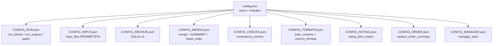
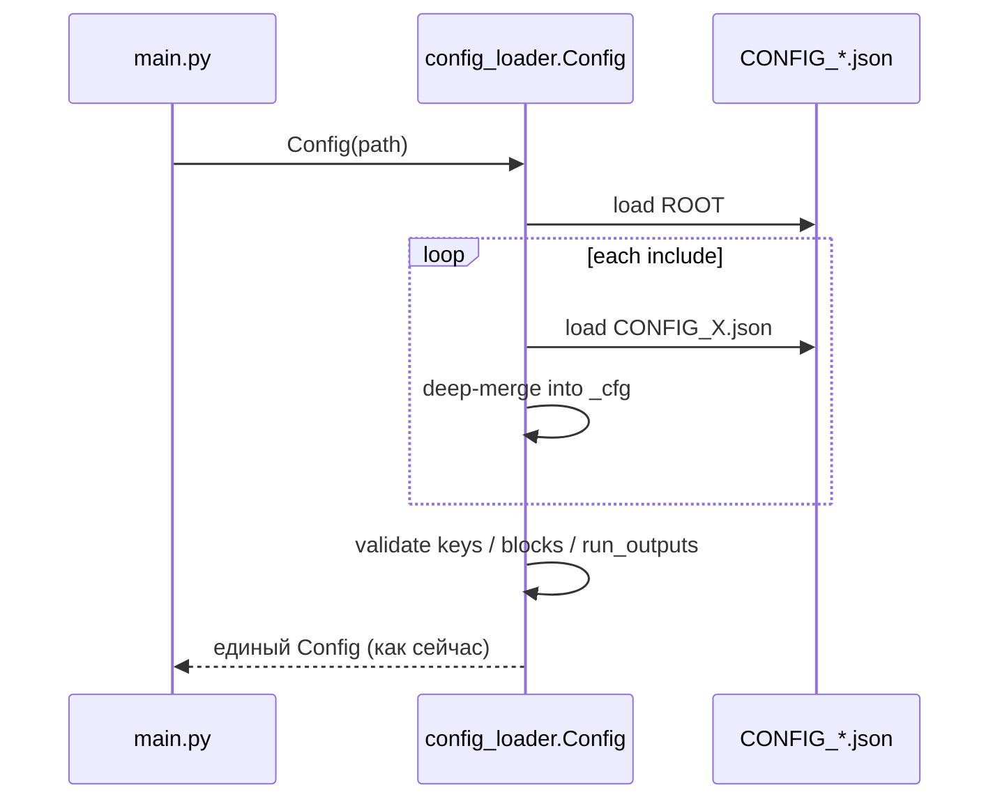
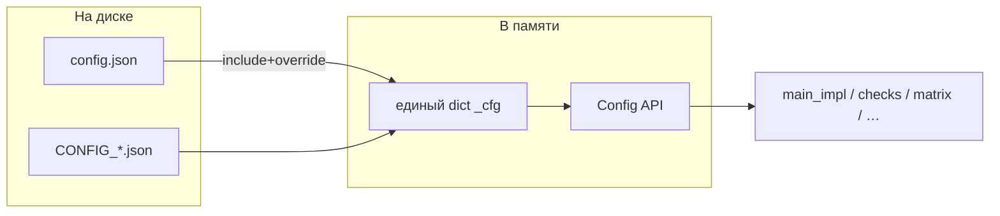
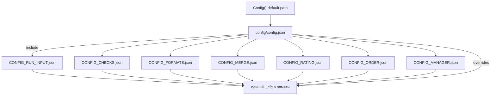

# Анализ разбиения `config.json` на доменные файлы

**Статус:** анализ утверждён; **реализация** — каталог `config/` и `Docs/CONFIG_FILES.md` (v1.7.53).  
**Связь:** пункт **8** в `ROADMAP.md`.  
**Мотив:** текущий `config.json` ~200 KB, ~6900 строк, ~30 верхних ключей — править вручную неудобно, высокий риск коллизий при merge и «случайных» правок не в своём разделе.

Имена файлов — шаблон **`CONFIG_<бизнес_смысл>.json`** (UPPER_SNAKE, коротко).

---

## 1. Текущий объём по разделам (замер локального конфига)

| Ключ / группа | ~размер JSON (символы) | Доля | Комментарий |
|---------------|------------------------|------|-------------|
| `input_files` (PROM/IFT/PSI) | ~34k | ★★★ | Список входов и `subdir`/`archive_*` |
| `consistency_checks` | ~30k | ★★★ | Правила, `csv_columns_count`, guide |
| `manager_stats` | ~27k | ★★★ | Отдельная книга, enrich, JS |
| `merge_fields_advanced` | ~23k | ★★★ | Откуда → куда колонки |
| `column_formats` | ~9k | ★★ | Типы ячеек Excel |
| `color_scheme` | ~6k | ★★ | Раскраска заголовков/колонок |
| `rating_item_matrix` | ~2k | ★ | Матрица ITEM на RATING |
| `input_archive_sqlite` | ~1.6k | ★ | Архив v2 |
| Остальное (пути, run_*, SUMMARY meta, gender, …) | ~few k | ★ | Управление запуском |

**Вывод:** 4–5 «толстых» доменов дают >80% файла. Их и надо выносить в первую очередь.

---

## 2. Цели разбиения

1. **Наглядность** — открыл файл → виден один бизнес-смысл.  
2. **Безопасность правок** — меняешь CHECKS, не трогаешь INPUT.  
3. **Обратная совместимость** — `config.json` (или тонкий `CONFIG_ROOT.json`) остаётся точкой входа; либо один собранный эффективный dict в памяти, как сейчас.  
4. **Без дублирования семантики** — один ключ = один файл-владелец (или явно объявленный override).  
5. **POST / sync** — снапшот должен уметь тащить набор `CONFIG_*.json` (позже).

---

## 3. Рекомендуемый вариант (A — гибрид, основной)

Маленький **корневой** файл + домены по вашему предложению + выделение `manager_stats` и архива (они слишком большие, чтобы «прилипнуть» к merge/rating).

```text
config.json                     ← точка входа (тонкий): includes + overrides / или только список include
CONFIG_RUN.json                 ← блоки, run_outputs, пути, logging, performance, имена OUT
CONFIG_INPUT.json               ← input_files по PROM/IFT/PSI + flags archive на файлах
CONFIG_ARCHIVE.json             ← input_archive_sqlite (схемы путей {BLOCK})
CONFIG_MERGE.json               ← merge_fields_advanced, summary_*, sheet_order, gender, json_columns, reward_getcondition_summary
CONFIG_CHECKS.json              ← consistency_checks (+ tournament_status_choices, check_duplicates при наличии)
CONFIG_FORMATS.json             ← color_scheme, column_formats (+ опц. часть manager_stats.column_formats — см. риски)
CONFIG_RATING.json              ← rating_item_matrix (+ связи листов RATING)
CONFIG_ORDER.json               ← season_order_summary (+ фильтры/колонки ORDER, если вынесем из matrix defaults)
CONFIG_MANAGER.json             ← manager_stats целиком
```

### Почему не слить RATING+ORDER в один файл

Логически связаны (`rating_item_matrix` читает ORDER и REWARD), но:

- правки сводки сезона (`season_order_summary`) чаще независимы от цветов/порогов матрицы;
- документная линия уже разделена: `RATING_MATRIX_*` vs `SEASON_ORDER_SUMMARY*`.

**Компромисс:** общий маленький `CONFIG_GAMIFICATION.json` = RATING+ORDER, если хотите меньше файлов (вариант B).

### Схема состава (вариант A)



### Схема сборки в памяти (как должно работать для кода)



**Важно для пайплайна:** модули продолжают читать `cfg.consistency_checks`, `cfg.merge_fields_advanced` и т.д. — **не менять публичный API Config** на первом этапе. Файлы — только способ хранения.

---

## 4. Альтернативы

### Вариант B — меньше файлов (ваш список почти 1:1)

| Файл | Содержимое |
|------|------------|
| `CONFIG_RUN_INPUT.json` | `run_*`, `paths`, `output_filenames`, `input_files`, `input_archive_sqlite`, `logging`, `performance` |
| `CONFIG_CHECKS.json` | `consistency_checks`, `tournament_status_choices` |
| `CONFIG_FORMATS.json` | `color_scheme`, `column_formats` |
| `CONFIG_MERGE.json` | `merge_fields_advanced`, `summary_*`, `sheet_order`, `gender`, `json_columns`, `reward_getcondition_summary` |
| `CONFIG_RATING.json` | `rating_item_matrix` |
| `CONFIG_ORDER.json` | `season_order_summary` (+ вынесенные order-фильтры при рефакторинге) |
| `CONFIG_MANAGER.json` | `manager_stats` (добавить — иначе один файл снова раздуется) |

Плюс: ближе к формулировке заказчика.  
Минус: `CONFIG_RUN_INPUT.json` всё ещё тяжёлый (~input_files + archive).

### Вариант C — по этапам пайплайна

```text
CONFIG_01_INPUT.json → CONFIG_02_ARCHIVE.json → CONFIG_03_MERGE.json
→ CONFIG_04_CHECKS.json → CONFIG_05_RATING_ORDER.json → CONFIG_06_EXCEL.json
→ CONFIG_07_MANAGER.json → CONFIG_00_RUN.json
```

Плюс: совпадает с mental model этапов прогресс-бара.  
Минус: имена с номерами хуже ищутся; бизнес-смысл вторичен.

### Вариант D — каталог `config/`

```text
config/
  ROOT.json
  RUN.json
  INPUT.json
  …
```

Плюс: корень проекта чище.  
Минус: меняются пути в `Config()`, POST-снимках, документации; делать **вторым шагом** после стабилизации include в корне.

---

## 5. Предлагаемое распределение ключей (вариант A — детально)

| Файл | Ключи верхнего уровня |
|------|------------------------|
| **config.json** (тонкий) | `"$include": ["CONFIG_RUN.json", …]` и/или локальные оверрайды (`run_blocks`, `run_outputs`) |
| **CONFIG_RUN.json** | `run_blocks`, `run_blocks_parallel`, `run_outputs`, `apply_sort_*`, `output_filenames`, `paths`, `logging`, `performance` |
| **CONFIG_INPUT.json** | `input_files` |
| **CONFIG_ARCHIVE.json** | `input_archive_sqlite` |
| **CONFIG_MERGE.json** | `merge_fields_advanced`, `summary_sheet`, `summary_key_defs`, `sheet_order`, `gender`, `json_columns`, `derived_columns` (если есть), `reward_getcondition_summary` |
| **CONFIG_CHECKS.json** | `consistency_checks`, `tournament_status_choices`, `check_duplicates` / `field_length_validations` (если используются) |
| **CONFIG_FORMATS.json** | `color_scheme`, `column_formats` |
| **CONFIG_RATING.json** | `rating_item_matrix` |
| **CONFIG_ORDER.json** | `season_order_summary` |
| **CONFIG_MANAGER.json** | `manager_stats` |

Заметки `_…_note` / `_…_allowed` — рядом с «своим» ключом в том же файле.

### Спорные места

| Тема | Рекомендация |
|------|--------------|
| `manager_stats.column_formats` | Оставить **внутри** `CONFIG_MANAGER.json` (форматы другой книги). `CONFIG_FORMATS.json` — только основная книга SPOD. |
| `item_order_groups` внутри `rating_item_matrix` | Остаётся в **CONFIG_RATING**; ORDER-сводка может ссылаться `use_item_order_groups` — явная связь, не копипаста. |
| `input_files[].archive_db_path` | Владелец — **INPUT**; шаблоны пути БД — **ARCHIVE**. |
| Оверрайды «на машине» | Тонкий `config.json` или `CONFIG_LOCAL.json` (в `.gitignore`) с приоритетом поверх includes. |

---

## 6. Механизм include (эскиз, без реализации)

Минимальный контракт:

```json
{
  "$include": [
    "CONFIG_RUN.json",
    "CONFIG_INPUT.json",
    "CONFIG_ARCHIVE.json",
    "CONFIG_MERGE.json",
    "CONFIG_CHECKS.json",
    "CONFIG_FORMATS.json",
    "CONFIG_RATING.json",
    "CONFIG_ORDER.json",
    "CONFIG_MANAGER.json"
  ],
  "run_blocks": ["PROM"],
  "run_outputs": {
    "PROM": ["main_only"]
  }
}
```

Правила merge:

1. Includes грузятся **по порядку**, deep-merge dict; list на верхнем уровне — **замена целиком** (не склейка правил checks/merge).  
2. Ключи корневого `config.json` после includes **перекрывают** (локальные оверрайды).  
3. Запрет дубля одного и того же top-level ключа в двух include (ошибка при загрузке) — ловит «два источника правды».  
4. Один монолитный `config.json` без `$include` — **обратная совместимость** (режим «как сейчас»).



---

## 7. План внедрения (поэтапно, в ROADMAP)

| Фаза | Что | Риск |
|------|-----|------|
| 0 | Этот анализ + ROADMAP п.8 | — |
| 1 | `config_loader`: поддержка `$include` + тесты на merge/override/ошибку дублей | низкий |
| 2 | Вынести 2–3 самых толстых: INPUT, CHECKS, MERGE (остальное в монолите) | средний |
| 3 | FORMATS, RATING, ORDER, MANAGER, ARCHIVE, RUN; тонкий root | средний |
| 4 | Доки README / INPUT_DATA_AND_CONFIG_FULL; обновление POST/sync | низкий |
| 5 | Опционально: каталог `config/` (вариант D) | средний |

Критерий готовности фазы: полный прогон `main_only` для PROM без изменения поведения относительно монолита (эталонный snapshot ключей `_cfg` или сравнение Excel-хешей).

---

## 8. Что сознательно не предлагаем

- YAML/TOML сейчас — лишняя зависимость и новый синтаксис для пользователей.  
- Дробить `input_files` на три файла `CONFIG_INPUT_PROM.json` … на **первом** шаге (можно позже, если списки разъедутся по составу).  
- Класть `Docs/` тексты внутрь JSON — только ссылки в `_note`.

---

## 9. Утверждённое решение (диалог 2026-07-15)

| # | Вопрос | Решение |
|---|--------|---------|
| 1 | Каталог | **`config/`** |
| 2 | JSON в корне проекта | **Нет** — `Config` сразу читает `config/config.json` |
| 3 | Файл-вход | **`config/config.json`** (`$include` + оверрайды запуска) |
| 4 | `manager_stats` | **`config/CONFIG_MANAGER.json`** |
| 5 | Архив SQLite | **внутри `CONFIG_RUN_INPUT.json`** |
| 6 | Имена файлов | **с префиксом `CONFIG_*.json`** |
| 7 | `CONFIG_LOCAL` | **нет** — только общие файлы в git |
| 8 | Старый корневой монолит | **удалить сразу** после переноса (без fallback) |
| 9 | `input_files` | **один файл** — в `CONFIG_RUN_INPUT.json` (разделы PROM/IFT/PSI) |
| 10 | POST / sync | **весь каталог `config/` как есть** |

Вариант состава: **B** + размещение в `config/`.

### Целевое дерево

```text
config/
  config.json                 ← точка входа ($include + оверрайды run_blocks / run_outputs)
  CONFIG_RUN_INPUT.json       ← run_*, paths, logging, performance, input_files, input_archive_sqlite
  CONFIG_CHECKS.json          ← consistency_checks (+ tournament_status_choices и др. связанное)
  CONFIG_FORMATS.json         ← color_scheme, column_formats
  CONFIG_MERGE.json           ← merge_fields_advanced, summary_*, sheet_order, gender, json_columns, …
  CONFIG_RATING.json          ← rating_item_matrix
  CONFIG_ORDER.json           ← season_order_summary
  CONFIG_MANAGER.json         ← manager_stats
```

В корне проекта **нет** `config.json`. База путей (`_base_dir`) — по-прежнему корень репозитория (родитель `config/`), не каталог конфигов.



Реализация — по ROADMAP п. **8.2+**. До старта кода: анализ утверждён.
