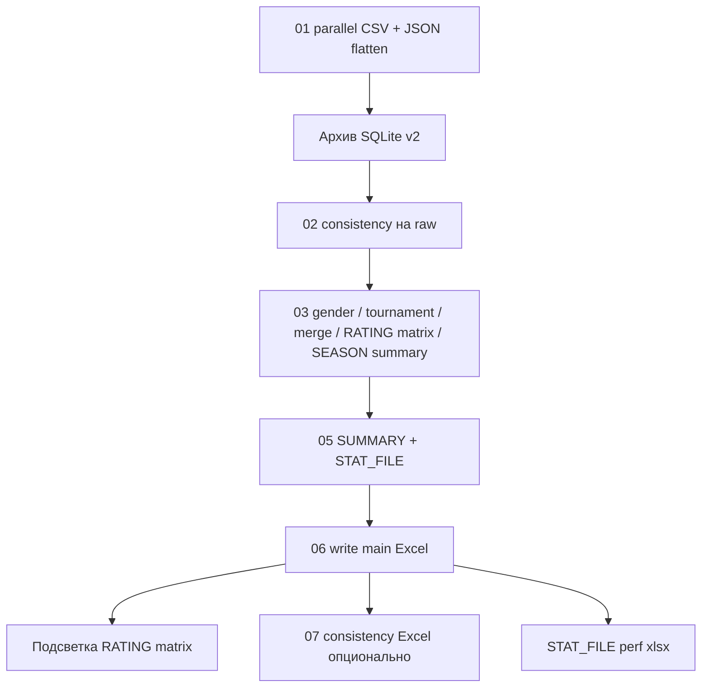

# Предложения по ускорению SPOD_PROM

**Дата анализа:** 2026-05-31  
**Версия кода:** ветка `main`, архив v2 (`row_level_archive`), матрица RATING, сводка ORDER-SEASON-SUMMARY  
**Связанные материалы:** `Docs/PERFORMANCE_AND_PARALLELIZATION_HISTORY.md`, `STAT_FILE *.xlsx`, логи `LOGS/`, консольный блок «Этапы (время)».

---

## 1. Резюме для принятия решений

На типичном полном прогоне (**main_only**, ~85 тыс. строк, 33 файла) **доминирует запись и оформление Excel** (~44 с из ~51 с суммы этапов `debug_phase`, ~87%). Остальные этапы (CSV, консистентность, merge, SUMMARY) в этом прогоне занимали **менее 7 с** суммарно.

**Wall-clock** при этом был **~84 с** — на **~33 с больше**, чем сумма этапов. Основные причины расхождения:

1. **Архив SQLite v2** выполняется **вне** `debug_phase` (между этапами `01` и `02`) и не попадает в таблицу «Этапы».
2. **Повторное открытие книги** для подсветки матрицы RATING (`load_workbook` после `write_to_excel`).
3. Старт/логирование, ранняя запись consistency (если включена), прочие операции без отдельной фазы.

**Главный рычаг ускорения:** упростить или разделить путь записи Excel (меньше проходов по ячейкам openpyxl).  
**Второй рычаг (при изменённых CSV):** архив v2 на больших листах (LIST-REWARDS ~39 тыс. строк) + исправление ошибки `too many SQL variables`.  
**Третий рычаг:** векторизация `rating_item_matrix` (`iterrows` на RATING) при включённой матрице.

Ожидаемый суммарный эффект при реализации пунктов **P0–P1** (см. §7): **сокращение wall-clock на 35–55%** на том же объёме данных (оценка; требует контрольного прогона).

---

## 2. Методология

| Источник | Что даёт |
|----------|----------|
| Консоль / `console_ui` | Таблица «Этапы (время)», топ `@debug_timed` |
| `STAT_FILE <timestamp>.xlsx` | Все `debug_phase` и агрегаты функций |
| Лог `LOGS` при `logging.level: DEBUG` | Строки `[PERF]`, детали архива (`hash_phase_sec`, `db_write_sec`) |
| Код `src/main_impl.py`, `input_archive_sqlite_v2.py`, … | Фактическая параллелизация и ограничения |

**Ограничение:** численные метрики ниже — **один зафиксированный прогон** (2026-05-31 11:47, macOS, M4). На других машинах и при **первичном ingest** архива (все CSV изменились) картина сместится в сторону архива и JSON.

---

## 3. Карта этапов пайплайна



| ID фазы | Имя `debug_phase` | Модули | Параллелизм сейчас |
|---------|-------------------|--------|-------------------|
| 01 | `01_parallel_csv_read_and_json_flatten` | `process_single_file`, `read_csv_file`, `flatten_json_column_recursive` | `ThreadPoolExecutor`, `max_workers_io` (16) |
| — | *(нет фазы)* | `run_input_archive_sqlite_v2` | `ProcessPoolExecutor` для хешей/классификации; SQLite — один поток |
| 02 | `02_consistency_pipeline_raw_and_csv_mismatch` | `consistency_checks` | 2 фазы правил, `ThreadPoolExecutor`, блокировка по листу |
| 03 | `03_gender_tournament_merge_reward_summary` | merge, `rating_item_matrix`, `season_order_summary` | merge: потоки по независимым правилам |
| 05 | `05_summary_stat_baseline` | `build_summary_sheet`, `build_stat_file_sheet` | последовательно |
| 06 | `06_write_main_excel` | `write_to_excel`, `_format_sheet` | подготовка листов — потоки; запись/формат — **последовательно** |
| 07 | `07_write_consistency_excel_full_mode` | `write_to_excel` | как 06 |

Конфиг потоков: `config.json` → `performance.max_workers_io` (16), `performance.max_workers_cpu` (8); архив → `input_archive_sqlite.parallel_row_processing`.

---

## 4. Фактические замеры (прогон 2026-05-31)

**Вход:** 33 файла, **85 494** строк (сумма по листам), режим **main_only**.  
**Wall-clock:** ~**83,6 с**.  
**Сумма этапов `debug_phase`:** ~**50,7 с**.

### 4.1. Этапы

| Этап | Время | Доля от Σ этапов |
|------|------:|-----------------:|
| 01 CSV + JSON | 0,30 с | 0,6% |
| 02 Консистентность | 0,34 с | 0,7% |
| 03 Merge / RATING / SEASON | 2,24 с | 4,4% |
| 05 SUMMARY | 3,76 с | 7,4% |
| 06 Excel main | **44,10 с** | **86,9%** |
| **Σ** | **50,74 с** | 100% |

### 4.2. Топ функций (`@debug_timed`)

| Функция | Суммарно | Вызовов | Комментарий |
|---------|----------|--------:|-------------|
| `write_to_excel` | 44,1 с | 1 | запись + форматирование всех листов |
| `_format_sheet` | 25,4 с | 39 | ~по одному на лист; проход по ячейкам |
| `process_single_file` | 4,59 с | 33 | чтение + JSON |
| `build_summary_sheet` | 3,75 с | 1 | merge ключей SUMMARY |
| `read_csv_file` | 2,28 с | 33 | I/O |
| `merge_fields_across_sheets` | 0,42 с | 1 | уже дёшево |

### 4.3. Архив v2 в том же прогоне

- Большинство файлов: **SHA без изменений** — построчный разбор **не выполнялся** (быстро).
- **LIST-REWARDS** (38 955 строк): **ошибка** `sqlite3.OperationalError: too many SQL variables` при `NOT IN (...)` по всем ключам файла — ingest не завершён, возможны повторные затраты при следующих запусках.

**Вывод:** при «тёплом» архиве узкое место — Excel; при «холодном» ingest крупных листов архив и JSON могут доминировать.

---

## 5. Детальный разбор узких мест

### 5.1. Запись Excel (`write_to_excel`, этап 06)

**Состав времени (оценка по топу функций):**

| Подэтап | ~Доля этапа 06 | Механизм |
|---------|----------------|----------|
| `DataFrame.to_excel` (openpyxl) | 30–45% | сериализация всех листов в один файл |
| `_format_sheet` | **~55–60%** | `iter_rows` по всем ячейкам данных + `apply_column_formats` (ещё один полный проход по столбцам) |
| `apply_color_scheme` | 5–15% | в основном заголовки; `style_scope: all` — полный столбец |
| Сортировка / `apply_column_format_conversion` | 5–10% | частично параллельно до записи |

**Тяжёлые листы в типичном наборе:**

- **LIST-REWARDS** (~39 тыс. строк, много колонок после JSON).
- **REPORT** (~20 тыс. строк).
- **STATISTICS** (~10,5 тыс.).
- **RATING** (агрегат ~8,9 тыс. + десятки колонок матрицы ITEM).

**Почему параллельное форматирование отключено:** openpyxl **не thread-safe** для одной книги; попытки v3–v4 давали регрессию (см. историю).

### 5.2. Повторное чтение Excel (матрица RATING)

После этапа 06 вызывается `apply_rating_item_matrix_colors`: **`load_workbook`** + покраска тысяч ячеек по списку `matrix_cells`. Время **не входит** в `06_write_main_excel`, но увеличивает wall-clock (оценка **5–20 с** на RATING ~9 тыс. строк × N колонок ITEM — зависит от `rating_item_matrix` в config).

### 5.3. Архив SQLite v2 (вне фаз)

При изменённом файле:

1. **hash** — `ProcessPoolExecutor`, `parallel_row_processing` (`chunk_size` 2000, workers = min(8, cpu−1) при `max_workers: 0`).
2. **compare** — процессы.
3. **db_write** — построчные `INSERT`/`UPDATE`; деактивация через `NOT IN (все ключи файла)`.

**Проблема масштаба:** SQLite лимит **~999 переменных** в запросе. Для LIST-REWARDS с десятками тысяч ключей запрос ломается — **функциональный баг + потеря выгоды от skip SHA**.

**Оценка при полном ingest 40k строк:** hash+compare **10–40 с** (CPU, 8 workers); db **20–120+ с** без батчинга (диск, одиночные execute).

### 5.4. JSON flatten (этап 01)

- Порог параллели: **> 5000** строк на колонку (`PARALLEL_JSON_THRESHOLD`).
- Потоки (`ThreadPoolExecutor`) — уместно для I/O+парсинга; на CPU-bound JSON выигрыш ограничен GIL.
- Дублирование: логика есть в `src/json_utils.py` и копия в `main_impl.py` — риск рассинхрона, не скорость.

**При первом прогоне** с тяжёлыми JSON (REWARD, CONTEST, LIST-REWARDS) этап 01 может быть **30–120+ с** — в замере 0,3 с файлы уже были в памяти/кэше ОС или JSON-колонки не доминировали.

### 5.5. Консистентность (этап 02)

61 правило, параллельно по правилам. При **0 нарушений** и уже «лёгких» листах — **< 1 с** (как в замере). При включении тяжёлых `json_spod_format` / referential на больших листах — **10–60+ с** возможны.

### 5.6. SUMMARY (этап 05)

`build_summary_sheet` ~3,75 с: множественные `add_fields_to_sheet` / merge по ключам. Потенциал **1,5–2,5×** за счёт кэша промежуточных ключей и сокращения копий DataFrame.

### 5.7. RATING matrix + SEASON summary (этап 03)

`apply_rating_item_matrix_enrichment` использует **`rating_df.iterrows()`** — O(строки × колонки матрицы). На ~9 тыс. строк и ~30–80 ITEM-колонок — **1–8 с** (в замере входит в 2,24 с этапа 03 вместе с merge).

`apply_season_order_summary` — группировки pandas; обычно **< 1–3 с** unless огромный каталог ITEM.

---

## 6. Что уже оптимизировано (не дублировать слепо)

См. `Docs/PERFORMANCE_AND_PARALLELIZATION_HISTORY.md` и комментарии в `main_impl.py` (v4–v5):

- Векторизация tournament status, tuple_key, gender (с fallback).
- Параллельное чтение CSV, пороговый параллельный JSON.
- Параллельные проверки консистентности с lock по листу.
- Параллельный merge независимых правил.
- Batch-ширины колонок (выборка 500 строк), кэш цветовых схем.
- Архив v2: процессы для hash/compare.

**Не рекомендуется без замеров:** снова параллелить `_format_sheet` на одной книге openpyxl; поднимать `max_workers_io` выше 16 (исторически — регрессии на I/O).

---

## 7. Сводная таблица предложений

Приоритет: **P0** — критично/максимальный ROI; **P1** — высокий ROI; **P2** — средний; **P3** — точечный или по запросу.

| ID | Предложение | Влияние на wall-clock (оценка) | Трудозатраты | Что потребуется |
|----|-------------|--------------------------------|--------------|-----------------|
| **P0-1** | **«Быстрый Excel»**: режим `performance.excel_fast` — отключить проход `iter_rows` для выравнивания всех ячеек; оставить заголовок + `COLUMN_FORMATS` только для нужных столбцов; опционально отключить `auto_filter` на листах > N строк | **−25% … −40%** | 2–4 дн. | Правки `_format_sheet`, `apply_column_formats`, флаги в `config.json`, README; регрессионный сравнитель xlsx |
| **P0-2** | **Батчинг SQL в архиве v2**: `NOT IN` / `IN` чанками ≤500 ключей; `executemany` для INSERT; индексы `(sheet_name, file_name, subdir, row_key_hash)` | **−5% … −35%** при полном ingest; устраняет сбой LIST-REWARDS | 2–3 дн. | `input_archive_sqlite_v2.py`, тест на 40k+ ключей |
| **P0-3** | Обернуть архив в `debug_phase("01b_input_archive_v2")` + логировать `hash/compare/db` в консоль | 0% скорости; **прозрачность** | 0,5 дн. | `main_impl.py`, `console_ui.expected_phases_*` |
| **P1-1** | **Одна сессия openpyxl для матрицы**: писать цвета в `write_to_excel` (перед save), без второго `load_workbook` | **−5% … −15%** | 2–3 дн. | `rating_item_matrix.py`, `write_to_excel` |
| **P1-2** | **xlsxwriter** для фазы «только данные» + openpyxl только для форматирования (или только листы с форматом) | **−10% … −25%** на этапе 06 | 4–6 дн. | Зависимость `xlsxwriter` в venv, ветвление в `write_to_excel` |
| **P1-3** | Векторизация **rating_item_matrix** (groupby по табельному, без `iterrows`) | **−2% … −8%** | 3–5 дн. | `rating_item_matrix.py`, тесты матрицы |
| **P2-1** | Листы-исключения: без цветовой схемы / без AUTO-ширины для `LIST-REWARDS`, `STATISTICS`, … | **−5% … −12%** | 1–2 дн. | `config.json` `performance.skip_formatting_sheets` |
| **P2-2** | **ProcessPool** для JSON при >5k строк (вместо threads) | **−5% … −20%** на этапе 01 при тяжёлом JSON | 2–3 дн. | `json_utils.py`, picklable worker |
| **P2-3** | Кэш каталога REWARD / правил ITEM между matrix и SEASON summary | **−1% … −4%** | 1–2 дн. | общий модуль кэша |
| **P2-4** | Снизить копирование DataFrame: `archive_payload` без лишнего `df_raw.copy()` где возможно | **−2% … −10%** RAM и GC | 2 дн. | `main_impl.py`, профиль памяти |
| **P3-1** | Опционально **orjson** для парсинга JSON | **−3% … −15%** на JSON-heavy прогонах | 1 дн. | зависимость, fallback на stdlib |
| **P3-2** | Отдельный «лёгкий» выход: CSV/Parquet для LIST-REWARDS без Excel-листа | **−10% … −30%** если лист не нужен в main | 1 дн. | config `exclude_sheets_from_main` |
| **P3-3** | WAL + `PRAGMA` для SQLite (synchronous=NORMAL) | **−5% … −15%** на db_write | 0,5 дн. | документировать риск при сбое питания |

**Суммарный потенциал P0+P1** (не сумма процентов — эффекты частично перекрываются): ориентир **35–55%** wall-clock на сценарии, близком к замеру §4.

---

## 8. Детализация ключевых решений

### 8.1. P0-1 — быстрый путь Excel

**Сейчас на каждом листе:**

1. `to_excel` записывает все ячейки.
2. `_format_sheet`: для **каждой** ячейки данных (кроме столбцов из `COLUMN_FORMATS`) — `Alignment`.
3. `apply_column_formats`: для каждого правила — цикл **всех строк** столбца.

**Предлагаемое поведение при `excel_fast: true`:**

- Выравнивание по умолчанию — **только строка 1** (заголовок).
- Данные — только столбцы из `column_formats` / `COLUMN_FORMATS`.
- Листы из списка `excel_fast_sheets` (или автоматически: `nrows > 5000`) — без `auto_filter`, без полного `iter_rows`.

**Риск:** визуально «проще» файл; для листов с ручной правкой в Excel — приемлемо.

**Оценка:** на замере §4 этап 06 **44,1 с** → ориентир **26–32 с** (−27% … −38% только этапа 06).

### 8.2. P0-2 — архив и LIST-REWARDS

Заменить один запрос:

```sql
AND row_key_hash NOT IN (?, ?, ... 38955 раз ...)
```

на цикл чанков по **500** ключей или временную таблицу `keys_tmp` + `JOIN`.

Дополнительно: транзакция на файл, `executemany` пакетами 500–2000 для `INSERT INTO archive_row_current`.

**Оценка:** ingest 39k строк с **ошибки + retry** → **30–90 с** устойчивого db; после оптимизации **15–45 с** (зависит от диска).

### 8.3. P1-1 — убрать второй проход по xlsx

Сегодня: write → close → load → paint → save.

**Цель:** перед `writer.save()` получить `ws = writer.sheets["RATING"]` и применить заливку из `meta["matrix_cells"]`.

**Оценка:** **5–15 с** wall-clock на типичном RATING.

### 8.4. Параллелизация — что имеет смысл добавить

| Область | Executor | Условие |
|---------|----------|---------|
| JSON flatten | `ProcessPoolExecutor` | `n_rows > 5000` и ≥2 колонок JSON |
| Архив db_write | фоновый writer thread + queue | после стабильного батчинга |
| Excel | **не** параллелить openpyxl на одном файле | — |
| Консистентность | уже threads | увеличивать workers только если CPU < 80% и нет регрессии |

### 8.5. Настройки config без кода (краткосрочно)

| Параметр | Эффект |
|----------|--------|
| `input_archive_sqlite.skip_ingest_if_file_unchanged: true` | уже даёт пропуск hash на неизменных файлах (**критично**) |
| `parallel_row_processing.max_workers: 4` | иногда стабильнее 8 на laptop — проверить A/B |
| `parallel_row_processing.chunk_size: 4000` | меньше overhead pool на 40k строк |
| `run_outputs: ["main_only"]` без `consistency_only` | минус второй `write_to_excel` |
| `rating_item_matrix` + `skip_colors: true` в meta/config | минус второй load_workbook |
| `apply_sort_to_main: false` | минус сортировка перед записью |

---

## 9. Риски и ограничения

| Риск | Митигация |
|------|-----------|
| «Быстрый Excel» меняет вид листов | флаг в config, по умолчанию `false` до приёмки |
| xlsxwriter ≠ openpyxl (формулы, валидации) | только листы «данные»; SUMMARY/CONSISTENCY — openpyxl |
| ProcessPool JSON — память | chunk_size, ограничение workers |
| Батч SQLite — частичный commit при падении | одна транзакция на файл ingest |
| Меньше потоков IO — дольше чтение CSV | замер на NVMe vs HDD |

---

## 10. План контрольных замеров (обязателен перед/после правок)

1. **Три сценария:**
   - **A:** все CSV без изменений (как §4).
   - **B:** изменён один крупный файл (LIST-REWARDS или REPORT).
   - **C:** удалён/пересоздан архив v2 (холодный ingest).

2. Для каждого сценария сохранить:
   - `STAT_FILE *.xlsx`;
   - скрин/копия блока «Этапы» и «Топ функций»;
   - при `DEBUG` — строки `[archive_v2]` с `hash_phase_sec`, `compare_phase_sec`, `db_write_sec`.

3. Метрики успеха:
   - wall-clock;
   - время этапа 06;
   - пик RSS (Activity Monitor / `/usr/bin/time -l`);
   - корректность: размер нарушений CONSISTENCY, выборочная сверка 20 ячеек RATING matrix.

4. Результаты дописывать в **`Docs/PERFORMANCE_AND_PARALLELIZATION_HISTORY.md`** (таблица «дата / сценарий / до / после / комментарий»).

---

## 11. Рекомендуемая очередность внедрения

1. **P0-2** — исправить SQLite `too many SQL variables` (блокирует архив LIST-REWARDS).
2. **P0-3** — видимость архива в этапах.
3. **P0-1** — `excel_fast` + список тяжёлых листов.
4. **P1-1** — цвета матрицы в одном проходе.
5. **P1-3** — векторизация matrix.
6. **P1-2** — xlsxwriter (если P0-1 недостаточно).

---

## 12. Связь с ROADMAP

Пункты производительности целесообразно добавить в `ROADMAP.md` как отдельный подраздел «Производительность» со ссылкой на этот файл, без начала кодирования до утверждения **P0-1** и **P0-2** заказчиком.

---

*Документ подготовлен по состоянию кода и логу прогона 2026-05-31. Числа «ожидаемого ускорения» — инженерные оценки; финальные проценты — только после сценариев §10.*
