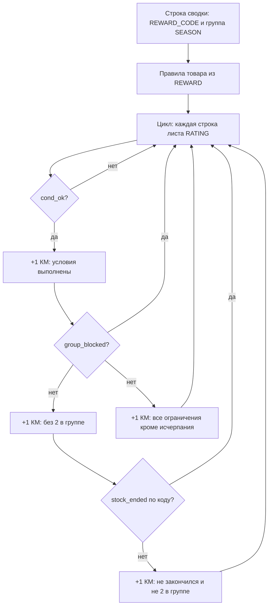

# ORDER-SEASON-SUMMARY: логика колонок «КМ:»

Описание **фактического** поведения кода (`src/season_order_summary.py`) для сверки с бизнес-ожиданием и правки формул.

Модуль: `_manager_rows_from_rating` → `_count_managers_for_code` → четыре счётчика в строке товара.

Связанные файлы: `src/reward_item_catalog.py` (`item_accessible_for_manager`), `src/rating_item_matrix.py` (`_blocked_codes_for_row`).

---

## 1. Кого считаем «КМ» (менеджером)

Берётся **каждая строка** агрегированного листа **RATING** (все файлы `RATING_*` из `config.json` сливаются в один лист `RATING` через `aggregate_into_sheet`).

Условие включения в цикл: непустой **«Табельный номер»** на этой строке RATING.

| Что читается из строки RATING | Поле в коде |
|-----------------------------|-------------|
| Место в рейтинге по стране | `rank_country` |
| Место в рейтинге ТБ | `rank_tb` |
| Место в рейтинге ГОСБ | `rank_gosb` |
| Количество кристаллов | `crystals` |

**Роль**, **период**, сезон строки RATING на доступность **не влияют**.

### Важно: дубли табельных

Если у одного табельного **несколько строк** на RATING (разная роль, период, разные выгрузки в одной книге), он участвует в подсчёте **столько раз, сколько строк**.

**Дедупликации по табельному нет** — один человек может дать +2 или +3 к каждой колонке «КМ:», если все его строки проходят условия.

---

## 2. Общие данные по табельному (для всех колонок «КМ:» в строке товара)

Данные считаются **по табельному номеру** (одинаковые для всех четырёх колонок в одной строке сводки по конкретному `REWARD_CODE`).

### 2.1. Заказы — лист ORDER

Используется агрегат **ORDER** (все `ORDER_*` в один лист). Строки со статусом **Отменён** или **Отклонён** **не учитываются**.

```
counts_by_emp[табельный][код_товара] = число строк ORDER (табельный + код)
order_by_emp[табельный]              = коды товаров, по которым есть хотя бы 1 заказ
```

- В расчёт попадают **все** коды из ORDER менеджера, не только код текущей строки сводки.
- Для условия **nonRewardCode** у товара: ни один код из списка «нельзя заказывать» не должен быть в заказах этого табельного.

### 2.2. Награды — лист LIST-REWARDS

```
rewards_by_emp[табельный] = множество «Код награды» с LIST-REWARDS для этого табельного
```

- Для условия **rewardCode** у товара: **каждый** требуемый код должен быть в этом множестве.

### 2.3. Лимит «2 заказа в группе сезона» (`group_blocked`)

Применяется только если у строки сводки указана **группа сезона** (`SEASON_2025_2`, `SEASON_m_2025_2` и т.д. из `item_order_groups`).

Алгоритм (`_blocked_codes_for_row`):

1. По всем кодам **этой группы** суммируются заказы **данного** табельного.
2. Если сумма **≥ `max_orders`** (в config обычно **2**) → табельный **исчерпал лимит группы**.
3. В множество `blocked` попадают **все** коды группы.
4. Для текущего кода в строке сводки: `group_blocked = (этот код ∈ blocked)`.

**Пример:** в группе 13 кодов ITEM; менеджер заказал два **разных** товара из группы (1+1). Тогда для **любого** кода группы, в том числе не заказанного им, `group_blocked = True`.

Для блока **«Прочие товары»** (колонка «Группа сезона» пустая): группа **не задана** → `group_blocked` **всегда False**, лимит 2 **не действует**.

### 2.4. Склад товара по строке сводки (`stock_ended`)

Считается **глобально по коду товара**, не по менеджеру:

```
stock_ended = (itemAmount задан в REWARD) И (Заказано по всему ORDER >= itemAmount)
```

«Заказано» — та же величина, что в колонке **Заказано** строки сводки.

Используется **только** в колонке **«КМ: не закончился и не 2 в группе»**.

---

## 3. Условие `cond_ok` — «условия товара выполнены»

Для **каждой** строки RATING и **конкретного** `REWARD_CODE` строки сводки вызывается  
`item_accessible_for_manager` — **та же логика**, что для зелёной ячейки на матрице ITEM на листе RATING.

Порядок проверок:

| № | Правило (REWARD_ADD_DATA) | Условие «проходит» |
|---|---------------------------|-------------------|
| 0 | `ignoreConditions` | Табельный строки RATING в списке → **сразу True**, остальное не проверяется |
| 1 | `minRatingBANK` > 0 | Место по стране **заполнено** и **≤** порога (меньшее число = лучше место) |
| 2 | `minRatingTB` > 0 | Место ТБ **≤** порога |
| 3 | `minRatingGOSB` > 0 | Место ГОСБ **≤** порога |
| 4 | `minCrystalEarnedTotal` > 0 | Кристаллы **≥** порога |
| 5 | `rewardCode` (непустой список) | Каждый код есть в LIST-REWARDS у табельного |
| 6 | `nonRewardCode` (непустой список) | Ни один запрещённый код нет в заказах табельного (ORDER) |

### Что **не** входит в `cond_ok`

- лимит **2 заказа в группе** (отдельно — `group_blocked`);
- глобальный **остаток склада** / «ЗАКОНЧИЛСЯ» (отдельно — `stock_ended`);
- заказал ли табельный **уже этот** `REWARD_CODE`;
- персональный лимит заказов на этот код (`itemAmount` на одного менеджера).

---

## 4. Четыре колонки «КМ:» — формулы в коде

Для **одной строки товара** (один `REWARD_CODE`) выполняется цикл по всем записям `managers` (всем строкам RATING с табельным).

Обозначения:

- **`cond_ok`** — раздел 3;
- **`group_blocked`** — раздел 2.3;
- **`stock_ended`** — раздел 2.4.

| Колонка в Excel | Условие в коде | Кратко |
|-----------------|----------------|--------|
| **КМ: условия выполнены** | `cond_ok` | Правила товара выполнены |
| **КМ: без 2 заказов в группе** | `cond_ok` **и** `NOT group_blocked` | + в группе сезона суммарно **< 2** заказов |
| **КМ: не закончился и не 2 в группе** | `cond_ok` **и** `NOT group_blocked` **и** `NOT stock_ended` | + на складе по коду ещё есть остаток |
| **КМ: все ограничения кроме исчерпания** | `cond_ok` **и** `NOT group_blocked` | + лимит 2 в группе; **склад не проверяется** |

Псевдокод:

```text
для каждой строки RATING с табельным:
    если cond_ok:
        +1  «КМ: условия выполнены»
        если не group_blocked:
            +1  «КМ: без 2 заказов в группе»
            +1  «КМ: все ограничения кроме исчерпания»
            если не stock_ended:
                +1  «КМ: не закончился и не 2 в группе»
```

---

## 5. Почему цифры могут «не сходиться» — расхождения с ожиданием

### 5.1. Две колонки считаются одинаково

В коде **совпадают**:

- **«КМ: без 2 заказов в группе»**
- **«КМ: все ограничения кроме исчерпания»**

Обе: `cond_ok AND NOT group_blocked`.

Колонка **«КМ: не закончился и не 2 в группе»** — это подмножество: к тем же условиям добавлен запрет глобального исчерпания склада (`stock_ended`).

По исходному ТЗ четвёртая метрика подразумевала «все ограничения, **кроме** того что товар закончился», но отличие от второй колонки в коде **не реализовано** — отличается только третья (со складом).

### 5.2. Один табельный = несколько «КМ»

Три строки RATING с одним табельным → до **+3** в каждой колонке «КМ:», если все строки проходят `cond_ok`.

### 5.3. Лимит 2 «режет» всю группу

Два заказа **разных** товаров одной группы → табельный не попадает в колонки с «без 2» / «кроме исчерпания» **ни для одного** кода группы, даже для товара, который не заказывал.

### 5.4. Блок «прочие товары» (без группы)

`group_blocked` всегда False → три колонки с лимитом группы **равны** «КМ: условия выполнены» (если `cond_ok`). Отдельно уменьшается только «не закончился…» при `stock_ended`.

### 5.5. Нет «мог бы заказать именно этот код»

Не учитывается:

- уже заказан ли **этот** `REWARD_CODE` данным табельным;
- личный потолок по `itemAmount` на менеджера (в матрице RATING при `item_amount_scope: global` это отдельная тема; в сводке не считается).

---

## 6. Сверка с формулировками из задачи (ТЗ)

| Формулировка из ТЗ | Ближайшая колонка сейчас | Совпадает с замыслом? |
|--------------------|--------------------------|------------------------|
| Сколько человек выполнили **все условия**, не смотря выбор товара и 2 заказа | **КМ: условия выполнены** | Частично (нет уникальных табельных) |
| Кто **ещё мог бы**, если бы не закончился товар и не 2 макс | **КМ: не закончился и не 2 в группе** | В целом да |
| Число **без** тех, кто уже набрал 2 в группе | **КМ: без 2 заказов в группе** | Да, по сумме заказов в группе |
| Могут заказать с **всеми** ограничениями, лимит 2, **кроме** исчерпания склада | **КМ: все ограничения кроме исчерпания** | **Нет** — в коде равна «без 2», склад не отделяет 4-ю колонку |

---

## 7. Схема потока (одна строка товара)



---

## 8. Чеклист для правки кода

Перед изменением `_count_managers_for_code` зафиксируйте ответы:

| № | Вопрос |
|---|--------|
| 1 | Считать **уникальные табельные** на RATING или **каждую строку** (роль + период)? |
| 2 | Лимит 2: при достижении блокировать **все коды группы** или только запрет «ещё один заказ в сезоне»? |
| 3 | Чем должны **отличаться** «КМ: без 2 заказов в группе» и «КМ: все ограничения кроме исчерпания»? |
| 4 | Исключать ли из «могут заказать» тех, кто **уже заказал этот** `REWARD_CODE`? |
| 5 | В каких колонках учитывать **глобальный остаток** (`stock_ended`)? |
| 6 | Для **прочих ITEM** без группы — нужен ли свой лимит «2 заказа» или только условия REWARD? |

---

## 9. Где менять в проекте

| Файл | Что править |
|------|-------------|
| `src/season_order_summary.py` | `_count_managers_for_code`, `_manager_rows_from_rating` |
| `src/reward_item_catalog.py` | `item_accessible_for_manager` (если меняются правила товара) |
| `src/rating_item_matrix.py` | `_blocked_codes_for_row` (если меняется лимит группы) |
| `config.json` | `item_order_groups`, `rating_item_matrix` |

После правки обновить этот документ и краткую таблицу в `Docs/SEASON_ORDER_SUMMARY.md`.
