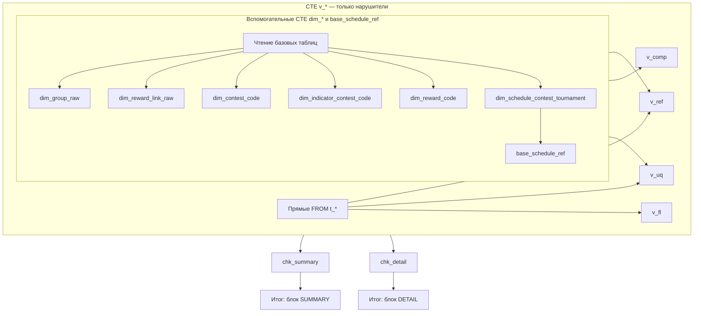

# Документация SQL-скрипта `SPOD_CONSISTENCY_CHECKS_SQL_MIRROR.sql`

Файл: **`Docs/SPOD_CONSISTENCY_CHECKS_SQL_MIRROR.md`**  
Исходный скрипт: **`Docs/SPOD_CONSISTENCY_CHECKS_SQL_MIRROR.sql`**

Документ описывает назначение скрипта, состав «команд» (на самом деле это **один** запрос), все CTE, все проверки, используемые таблицы и поля, а также что нужно заменить под вашу витрину данных.

---

## 1. Назначение

- **Зеркало** части правил из `config.json` → секция **`consistency_checks.rules`**: типы **`referential`**, **`referential_composite`**, **`unique`**, **`field_length`**.
- Скрипт **не вызывается** из Python-пайплайна SPOD_PROM; его выполняют вручную в клиенте СУБД (Hive, Spark SQL и т.п.) против таблиц витрины, соответствующих листам Excel выгрузки.
- Идентификаторы проверок **`check_id`** совпадают с полем **`rules[].id`** в конфиге (для зеркалируемых правил).
- Логика согласована с модулем **`src/consistency_checks.py`**; подробный формат правил — в **`Docs/CONSISTENCY_CHECKS_FORMAT.md`**.

**В SQL намеренно не переносятся:**

| Категория | Пояснение |
|-----------|-----------|
| **`field_format`** (все `format_*`) | Форматы полей проверяются только в Python. |
| **`json_field_*`**, **`json_priority_*`** | Нужен разбор JSON в СУБД или отдельный слой. |
| **`csv_columns_count`** | Относится к сырому CSV, не к витрине. |
| Правила с **`enabled: false`** | В конфиге отключены **`ref_contest_data_indicator`**, **`ref_group_indicator`** — в SQL их нет. |

---

## 2. Что выполняется: одна команда, не пакет

В файле после комментариев идёт **единственный исполняемый оператор** SQL:

1. Ключевое слово **`WITH`** открывает цепочку CTE (общие табличные выражения).
2. Через запятую перечислены CTE: сначала вспомогательные **`dim_*`** / **`base_schedule_ref`**, затем наборы нарушителей **`v_*`**, затем **`chk_summary`**, **`chk_detail`**.
3. После закрытия блока `WITH` идёт **итоговый `SELECT … UNION ALL SELECT … ORDER BY`** до точки с запятой **`;`**.

То есть движку передаётся **одна логическая команда** (один запрос). Отдельных `INSERT`, `CREATE TABLE` в скрипте нет — при необходимости результат оборачивают сами: `CREATE TABLE … AS`, `INSERT INTO … SELECT`, сохранение в файл из IDE.

---

## 3. Диалект SQL и перенос на другую СУБД

Ориентир: **Hive / Spark SQL**.

| Конструкция в скрипте | Замечание |
|---------------------|-----------|
| **`RLIKE 'шаблон'`** | Регулярное выражение. В PostgreSQL обычно **`~`** или **`~*`**. |
| **`CONCAT_WS(разделитель, a, b, …)`** | В PostgreSQL: **`concat_ws`** или склейка **`a \|\| разделитель \|\| b`**. |
| **`CAST(x AS STRING)`** | В PostgreSQL часто **`TEXT`** или **`VARCHAR`**. |

Остальная логика (`WITH`, `LEFT JOIN`, `GROUP BY`, `HAVING`, `UNION ALL`) переносится на типовой SQL с минимальными правками синтаксиса.

---

## 4. Обязательные замены перед запуском

### 4.1. Схема / каталог

Во всём файле используется квалификатор **`spod_dq`** (например, `spod_dq.t_group`).

**Действие:** глобальная замена в редакторе на ваш **каталог Hive**, **схему PostgreSQL** или префикс базы, например `my_catalog.my_schema`.

### 4.2. Имена таблиц

В проекте задано условное соответствие **лист Excel → таблица витрины**. Если ваши физические имена другие — замените **каждое** вхождение в `FROM` / `JOIN`.

| Лист выгрузки (config) | Плейсхолдер в SQL |
|------------------------|-------------------|
| CONTEST-DATA | `spod_dq.t_contest_data` |
| GROUP | `spod_dq.t_group` |
| INDICATOR | `spod_dq.t_indicator` |
| REWARD-LINK | `spod_dq.t_reward_link` |
| REWARD | `spod_dq.t_reward` |
| TOURNAMENT-SCHEDULE | `spod_dq.t_tournament_schedule` |
| ORG_UNIT_V20 | `spod_dq.t_org_unit_v20` |
| EMPLOYEE | `spod_dq.t_employee` |
| REPORT | `spod_dq.t_report` |
| USER_ROLE | `spod_dq.t_user_role` |
| USER_ROLE SB | `spod_dq.t_user_role_sb` |

### 4.3. Имена полей (колонок)

Скрипт предполагает, что колонки в витрине **совпадают по имени** с полями листов SPOD (как в Excel/конфиге). Если в вашей БД колонки названы иначе (например, snake_case vs UPPER_CASE), нужно:

- либо создать **представление (VIEW)** с алиасами под имена из скрипта;
- либо **править скрипт** во всех `SELECT` / `JOIN` / `WHERE` для затронутых проверок.

Ниже в разделе 7 перечислены **все используемые поля** по таблицам.

---

## 5. Структура скрипта (поток данных)

1. **`dim_*`** — урезанные копии или **множества ключей** (`DISTINCT`), чтобы не читать полные таблицы лишний раз и переиспользовать одни и те же наборы в нескольких проверках.
2. **`base_schedule_ref`** — одна строка на строку расписания плюс три «флага» наличия `CONTEST_CODE` в CONTEST-DATA / INDICATOR / GROUP (для `scenario_1`, `scenario_16`, `scenario_20`).
3. **`v_*`** — в каждом CTE только строки **нарушений** (или пустой результат). Колонки: `check_id`, `check_type`, `detail_key`, `detail_message`.
4. **`chk_summary`** — для каждого `check_id`: **`violation_count`** = `COUNT(*)` из соответствующего `v_*`.
5. **`chk_detail`** — **`UNION ALL`** всех `v_*` в один длинный список деталей.
6. **Финальный `SELECT`** — объединяет:
   - строки с **`report_section = 'SUMMARY'`** (`passed` 1/0, `violation_count`);
   - строки с **`report_section = 'DETAIL'`** (`detail_key`, `detail_message`).

Сортировка: сначала весь SUMMARY (`result_order = 1`), затем весь DETAIL (`result_order = 2`), внутри — по `check_id`, `detail_key`.

---

## 6. Вспомогательные CTE (`dim_*`, `base_schedule_ref`)

| CTE | Источник | Назначение |
|-----|----------|------------|
| **`dim_group_raw`** | `t_group` | Все строки GROUP: `CONTEST_CODE`, `GROUP_CODE`, `GROUP_VALUE`. База для unique и composite. |
| **`dim_group_contest_code`** | `dim_group_raw` | Уникальные `CONTEST_CODE` из GROUP. |
| **`dim_group_contest_group_pair`** | `dim_group_raw` | Уникальные пары `(CONTEST_CODE, GROUP_CODE)`. |
| **`dim_reward_link_raw`** | `t_reward_link` | Все строки REWARD-LINK. |
| **`dim_reward_link_reward_code`** | `dim_reward_link_raw` | Уникальные `REWARD_CODE` в связях. |
| **`dim_reward_link_contest_group_pair`** | `dim_reward_link_raw` | Уникальные пары `(CONTEST_CODE, GROUP_CODE)` в связях. |
| **`dim_contest_code`** | `t_contest_data` | Уникальные `CONTEST_CODE` (справочник конкурсов). |
| **`dim_indicator_contest_code`** | `t_indicator` | Уникальные `CONTEST_CODE` в INDICATOR. |
| **`dim_reward_code`** | `t_reward` | Уникальные `REWARD_CODE` в REWARD. |
| **`dim_schedule_contest_tournament`** | `t_tournament_schedule` | Строки расписания: `CONTEST_CODE`, `TOURNAMENT_CODE`. |
| **`dim_schedule_tournament_contest_pair`** | `dim_schedule_contest_tournament` | Уникальные пары `(TOURNAMENT_CODE, CONTEST_CODE)`. |
| **`base_schedule_ref`** | `dim_schedule_contest_tournament` + LEFT JOIN к `dim_contest_code`, `dim_indicator_contest_code`, `dim_group_contest_code` | Для каждой строки расписания: есть ли код в трёх справочниках (`ref_contest_data`, `ref_indicator`, `ref_group` — по сути NOT NULL с JOIN). |

---

## 7. Таблицы витрины и используемые поля

Ниже — перечень полей, которые **фактически читает** скрипт (для маппинга на вашу БД).

### `t_contest_data` (CONTEST-DATA)

- `CONTEST_CODE`

### `t_group` (GROUP)

- `CONTEST_CODE`, `GROUP_CODE`, `GROUP_VALUE`

### `t_indicator` (INDICATOR)

- `CONTEST_CODE`
- `INDICATOR_ADD_CALC_TYPE`, `INDICATOR_CODE` (unique)
- `N` (unique)

### `t_reward_link` (REWARD-LINK)

- `CONTEST_CODE`, `GROUP_CODE`, `REWARD_CODE`

### `t_reward` (REWARD)

- `REWARD_CODE`

### `t_tournament_schedule` (TOURNAMENT-SCHEDULE)

- `CONTEST_CODE`, `TOURNAMENT_CODE`

### `t_org_unit_v20` (ORG_UNIT_V20)

- `ORG_UNIT_CODE`
- `TB_FULL_NAME`, `GOSB_NAME`, `GOSB_SHORT_NAME` (длина)
- `TB_CODE`, `GOSB_CODE` (unique)

### `t_employee` (EMPLOYEE)

- `ORG_UNIT_CODE` (referential)
- `PERSON_NUMBER`, `PERSON_NUMBER_ADD` (unique и длина)
- `POSITION_NAME`, `KPK_CODE` (условный unique для КПК)

### `t_report` (REPORT)

- `CONTEST_CODE`, `TOURNAMENT_CODE`, `MANAGER_PERSON_NUMBER` (unique и длина)

### `t_user_role` (USER_ROLE)

- `RULE_NUM`

### `t_user_role_sb` (USER_ROLE SB)

- `RULE_NUM`

Если какого-то столбца нет в витрине, соответствующие проверки нужно **отключить** (удалить ветки из `chk_summary` / `chk_detail` и CTE `v_*`) или **адаптировать** под вашу схему.

---

## 8. Проверки: referential (`v_ref_*`)

Общий приём: **`LEFT JOIN`** фактовой таблицы со справочником по ключу; в **`WHERE`** остаются строки, где справа **`NULL`**, а слева значение считается заполненным (`IS NOT NULL` и `TRIM(CAST(... AS STRING)) <> ''`).

| check_id | CTE | Факт (откуда значение) | Справочник (где должно быть) |
|----------|-----|------------------------|------------------------------|
| `1.1` | `v_ref_1_1` | `dim_group_raw` → `CONTEST_CODE` | `dim_contest_code` |
| `1.2` | `v_ref_1_2` | `t_indicator` → `CONTEST_CODE` | `dim_contest_code` |
| `1.3` | `v_ref_1_3` | `dim_reward_link_raw` → `CONTEST_CODE` | `dim_contest_code` |
| `2` | `v_ref_2` | `dim_reward_link_raw` → `REWARD_CODE` | `dim_reward_code` |
| `9` | `v_ref_9` | `t_employee` → `ORG_UNIT_CODE` | `t_org_unit_v20` по `ORG_UNIT_CODE` |
| `scenario_1` | `v_ref_scenario_1` | `base_schedule_ref` → `CONTEST_CODE` | наличие в CONTEST-DATA (`ref_contest_data IS NULL`) |
| `scenario_16` | `v_ref_scenario_16` | то же | наличие в INDICATOR (`ref_indicator IS NULL`) |
| `scenario_20` | `v_ref_scenario_20` | то же | наличие в GROUP (`ref_group IS NULL`) |
| `ref_contest_data_group` | `v_ref_contest_data_group` | `t_contest_data` → `CONTEST_CODE` | `dim_group_contest_code` |
| `ref_indicator_group` | `v_ref_indicator_group` | `t_indicator` → `CONTEST_CODE` | `dim_group_contest_code` |
| `ref_report_contest_data` | `v_ref_report_contest_data` | `t_report` → `CONTEST_CODE` | `dim_contest_code` |
| `ref_reward_reward_link` | `v_ref_reward_reward_link` | `t_reward` → `REWARD_CODE` | `dim_reward_link_reward_code` |

**Примечание:** в конфиге могут быть отключены другие referential-правила; в SQL **нет** зеркал для `ref_contest_data_indicator` и `ref_group_indicator` (см. хвост `SPOD_CONSISTENCY_CHECKS_SQL_MIRROR.sql`).

---

## 9. Проверки: referential_composite (`v_comp_*`)

JOIN по **двум и более** полям; снова `LEFT JOIN` + отсутствие совпадения в справочнике.

| check_id | CTE | Смысл |
|----------|-----|--------|
| `5` | `v_comp_5` | Каждая пара `(CONTEST_CODE, GROUP_CODE)` из REWARD-LINK должна существовать в GROUP. |
| `ref_composite_group_reward_link` | `v_comp_grp_rl` | Каждая пара из GROUP должна встречаться в REWARD-LINK. |
| `ref_composite_report_schedule` | `v_comp_rep_sch` | Каждая пара `(TOURNAMENT_CODE, CONTEST_CODE)` из REPORT должна быть в расписании (`dim_schedule_tournament_contest_pair`). |

В **`detail_key`** составные ключи склеиваются через **`CONCAT_WS('|', …)`**.

---

## 10. Проверки: unique (`v_uq_*`)

Приём: подзапрос с **`GROUP BY`** по бизнес-ключу и **`HAVING COUNT(*) > 1`**. В DETAIL попадает **одна строка на каждый дублирующийся ключ** (не каждая физическая строка таблицы).

| check_id | CTE | Ключ уникальности | Таблица / источник |
|----------|-----|-------------------|---------------------|
| `3` | `v_uq_3` | `CONTEST_CODE`, `GROUP_CODE`, `GROUP_VALUE` | `dim_group_raw` |
| `4` | `v_uq_4` | `CONTEST_CODE`, `GROUP_CODE`, `REWARD_CODE` | `dim_reward_link_raw` |
| `unique_contest_data` | `v_uq_contest_data` | `CONTEST_CODE` | `t_contest_data` |
| `unique_indicator_1` | `v_uq_ind1` | `CONTEST_CODE`, `INDICATOR_ADD_CALC_TYPE`, `INDICATOR_CODE` | `t_indicator` |
| `unique_indicator_n` | `v_uq_ind_n` | `N` | `t_indicator` |
| `unique_report` | `v_uq_report` | `MANAGER_PERSON_NUMBER`, `TOURNAMENT_CODE`, `CONTEST_CODE` | `t_report` |
| `unique_reward` | `v_uq_reward` | `REWARD_CODE` | `t_reward` |
| `unique_reward_link_2` | `v_uq_rl2` | `CONTEST_CODE`, `REWARD_CODE` | `dim_reward_link_raw` |
| `unique_reward_link_reward` | `v_uq_rl_r` | `REWARD_CODE` | `dim_reward_link_raw` |
| `unique_schedule_2` | `v_uq_sch2` | `TOURNAMENT_CODE`, `CONTEST_CODE` | `dim_schedule_contest_tournament` |
| `unique_schedule_1` | `v_uq_sch1` | `TOURNAMENT_CODE` | `dim_schedule_contest_tournament` |
| `unique_org_unit` | `v_uq_org` | `ORG_UNIT_CODE` | `t_org_unit_v20` |
| `unique_tb_gosb` | `v_uq_tb_gosb` | `TB_CODE`, `GOSB_CODE` | `t_org_unit_v20` |
| `unique_user_role` | `v_uq_ur` | `RULE_NUM` | `t_user_role` |
| `unique_user_role_sb` | `v_uq_ursb` | `RULE_NUM` | `t_user_role_sb` |
| `unique_employee_person` | `v_uq_emp_p` | `PERSON_NUMBER` | `t_employee` |
| `unique_employee_person_add` | `v_uq_emp_pa` | `PERSON_NUMBER_ADD` | `t_employee` |
| `unique_employee_kpk_gosb` | `v_uq_emp_kpk` | `POSITION_NAME`, `KPK_CODE`, `ORG_UNIT_CODE` | `t_employee`, только строки с `POSITION_NAME = 'КПК'` и непустым `KPK_CODE` (не `''` и не `'-'` после TRIM) |

---

## 11. Проверки: field_length (`v_fl_*`)

После **`CAST(... AS STRING)`** считается **`LENGTH`**. В выборку попадают только строки, не удовлетворяющие ограничению.

| check_id | CTE | Условия |
|----------|-----|---------|
| `field_length_org_unit` | `v_fl_org` | Три ветки **`UNION ALL`** на `t_org_unit_v20`: `LENGTH(TB_FULL_NAME) > 100`, `LENGTH(GOSB_NAME) > 100`, `LENGTH(GOSB_SHORT_NAME) > 20`. |
| `field_length_employee` | `v_fl_emp` | `LENGTH(PERSON_NUMBER) <> 20` и то же для `PERSON_NUMBER_ADD`. |
| `field_length_report` | `v_fl_rep` | `LENGTH(MANAGER_PERSON_NUMBER) <> 20` на `t_report`. |

---

## 12. CTE `chk_summary` и `chk_detail`

- **`chk_summary`**: для каждого `check_id` из списка — литерал `check_id`, `check_type`, и подзапрос **`(SELECT COUNT(*) FROM v_…)`** как `violation_count`.
- **`chk_detail`**: последовательность **`UNION ALL SELECT … FROM v_…`** для всех тех же `v_*`, что учтены в сводке.

Порядок строк в `chk_summary` может **не совпадать** с порядком объектов в `config.json`; ориентир — совпадение **`check_id`**.

---

## 13. Итоговый результат запроса (колонки)

| Колонка | В SUMMARY | В DETAIL |
|---------|-----------|----------|
| `result_order` | `1` | `2` |
| `report_section` | `'SUMMARY'` | `'DETAIL'` |
| `check_id` | да | да |
| `check_type` | да | да |
| `passed` | `1` если `violation_count = 0`, иначе `0` | `NULL` |
| `violation_count` | число | `NULL` |
| `detail_key` | `NULL` | ключ нарушения (строка) |
| `detail_message` | `NULL` | текст пояснения |

**Примеры фильтров:**

- только сводка: `WHERE report_section = 'SUMMARY'`
- только упавшие проверки: `WHERE report_section = 'SUMMARY' AND passed = 0`
- детали по одному правилу: `WHERE report_section = 'DETAIL' AND check_id = '1.1'`

---

## 14. Связь с конфигом и кодом

- Правила: **`config.json`** → **`consistency_checks`** → **`rules`**.
- Реализация на листах Excel: **`src/consistency_checks.py`** (`run_all_consistency_checks`, `_run_unique_check`, `_run_field_length_check`, referential/composite).
- Формат правил и вывода: **`Docs/CONSISTENCY_CHECKS_FORMAT.md`**.

---

## 15. История версий документа

| Версия | Изменения |
|--------|-----------|
| 1.0 | Первоначальное описание скрипта: структура CTE, все проверки, таблицы и поля, замены для витрины, исключения (field_format, json, csv_columns_count). |
